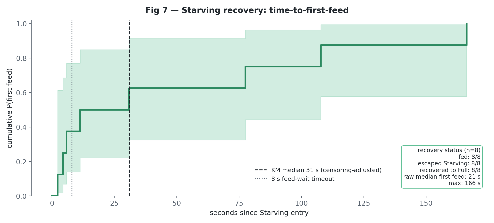

# Orexigenic Drive & Always-On Homeostasis — Analysis Explained

This document explains the data analysis in
[`analysis/orexigenic_analysis.ipynb`](analysis/orexigenic_analysis.ipynb): **what we did, why,
how, and what came out** — and reads the results critically, separating what the code guarantees
from what the data show.

> **System under study.** The *Orexigenic Drive* of the `alwaysOn-embodiedBehaviour` iCub
> controller — a continuous "metabolism" that makes the robot get hungry, ask to be fed, and
> reprioritise its behaviour around recovering energy. Pipeline:
> *perception → salience → executive → remote/Telegram*.

**Contents**

1. [Research questions & design](#1-research-questions--design)
2. [The data](#2-the-data)
3. [Statistical approach](#3-statistical-approach)
4. [RQ1 — Is this a real homeostatic drive?](#4-rq1--is-this-a-real-homeostatic-drive)
5. [RQ2 — Does deficit expression lead to reliable recovery?](#5-rq2--does-deficit-expression-lead-to-reliable-recovery)
6. [RQ3 — Is the adaptation real? Mechanism (B9) + validation (B10)](#6-rq3--is-the-adaptation-real-mechanism-b9--validation-b10)
7. [Machine-learning sensitivity checks](#7-machine-learning-sensitivity-checks-phase-d)
8. [Scorecard & bottom line](#8-scorecard--bottom-line)
9. [Reproducing this](#9-reproducing-this)

---

## 1. Research questions & design

- **RQ1** — To what extent does the orexigenic drive fulfil the four functions of classical
  homeostasis: (1) internal monitoring, (2) deficit detection, (3) deficit-to-action
  conversion, (4) behavioural prioritisation?
- **RQ2** — Does expressing an orexigenic deficit promote recovery-oriented engagement
  sufficient to support reliable energy replenishment in an always-on social robot?
- **RQ3** — Does the robot's **adaptive component** (the learned per-person homeostatic
  affinity) reflect *real* participant behaviour rather than arbitrary drift, and does what it
  learns change the robot's own later behaviour? The role manipulation is experiment metadata
  used for validation only; it was never available to the robot or used by the software.

### Two design facts that shape everything

**First: the drive was always on.** There is **no drive-off control condition** and none is
invented. RQ2 is identified from within the always-on data: the **graded deficit**
(Full → Hungry → Starving) is the manipulation, and the **proactive vs reactive** contrast
tests whether the drive *initiates* recovery.

**Second: two 4-day phases with a participant role manipulation.** In **Phase 1** (first four
experiment days) two participants were **obligated feeders**, two were told to **interact but
never feed**, and everyone else behaved normally. In **Phase 2** (last four days) all
constraints were lifted. The roles *induce* known behaviour, giving RQ3 ground truth to test
the learning against. These roles are external experimental labels, not controller inputs. The
role map is private (`analysis/private/role_phase.json`); published outputs carry pseudonyms and
role labels only. With **2 people per controlled role**, role contrasts are manipulation
validation with wide uncertainty — never population inference.

### The answers, up front

**RQ1 — yes, specifically a *threshold* controller.** Monitoring and detection are
faithful-implementation facts (software integrator, coded 60/25 thresholds — true by
construction; the non-trivial content is dense autonomous 2.3-s sampling across 46 h and zero
threshold flapping). The load-bearing results are behavioural: at the deficit line the robot
switches on a **proactive recovery repertoire** silent at Full — hunger framing 3% → 67%,
feed-seeking acts and proactive Telegram pings 1 → 20 and 0 → 172, feeding pursuit
0.15 → 0.43 (**OR 4.9 [2.6, 9.5]**, person-clustered GEE); at the starving line it
**overrides** the social agenda (turns 2.5 → 0.2, Engaged 0.68 → 0.08; **OR 0.03
[0.01, 0.14]**). *Recovery behaviour is added at 60 and social behaviour overridden at 25 — a
two-threshold controller, not a smooth ramp.*

**RQ2 — yes, and this is the study's most important result.** The deficit elicits graded
feeding (meal size 21 → 29 → 43) and modest off-robot replies (proactive ping-reply
0.21–0.26); the 8 observed Starving episodes all resolved by feeding (exploratory). Crucially,
**the people kept the robot fed**: long-run Starving occupancy is **~1%** (run-level block
bootstrap 95% CI 0.2–3.1%), with no absorbing "starve-out" state. That number is the *outcome
of the closed HRI loop working* — the drive signalled, humans engaged, homeostasis held — not
a self-property of the controller. Caveat: feeding leaned on a few users (Gini 0.57,
top-3 = 62%).

**RQ3 — yes, the learned affinity is a faithful record of behaviour, and the robot acts on
it.** The manipulation validated: obligated feeders supplied meals at **2.7× the unconstrained
rate** [1.2, 5.9], the no-feed pair complied perfectly (**0 feeds in 15 Phase-1
interactions**), and the feeder excess shrank once roles lifted. The pre-specified core model
(`Δaffinity ~ dose×role + dose×phase + (1|person)`) shows engagement dose predicting affinity
gains (+0.17 per SD of duration [+0.12, +0.21]), **moderated by role** (feeders' affinity came
from *feeding*, not chat length) and **attenuated in Phase 2**; all three dose definitions
agree and the effect survives leave-one-person-out. And the learning is *used*: **prior
affinity raises next-day proactive approaches 1.55× per +1 affinity [1.09, 2.20]**,
activity-adjusted and leakage-free.

---

## 2. The data

The robot logs to four SQLite databases (`vision`, `salience_network`, `executive_control`,
`chat_bot`); `data/` holds eight dated snapshots. **Key data-prep discovery:** the folders are
**cumulative snapshots of one growing database**, not eight experiments — naïve stacking would
double-count 4–5×. Everything is therefore de-duplicated to the true units:

- **run** (`run_id`) — one continuous robot session (12 monitored, 10 with visitors);
- **day** (`day_rome`) — 8 days, split 4 + 4 into Phase 1 / Phase 2;
- **interaction** — 217 after de-duplication, over 14 named (pseudonymised) people;
- **affinity update event** — 205 learning-eligible events (the RQ3 unit);
- **person-day, ping, transition, episode** — for the analyses that need them.

Everything is verified against the controller source before analysis: a **verification gate**
(V1–V5) checks meal deltas, per-action energy costs, drain rate, thresholds, referential
integrity, and clock sanity against constants extracted from the code with file:line
references. All checks passed; nothing proceeds otherwise.

---

## 3. Statistical approach

Observations repeat within people, runs and days, so **no confirmatory claim rests on
row-independence tests**:

- **Binary/count contrasts** → logistic / Poisson **GEE, clustered on person** (robust
  sandwich SEs; run-clustered as sensitivity).
- **Continuous affinity outcomes** → **linear mixed models** with a person random intercept
  (cluster-robust OLS as companion).
- **Long-run occupancy** → CTMC with a **run-level block bootstrap** (the cluster-honest
  interval), Poisson bootstrap as secondary.
- **Cells with complete separation by design** (the no-feed pair: 0 feeds) → **exact
  Clopper–Pearson CIs**, not forced GLMs.
- **Multiplicity** → Benjamini–Hochberg **within two pre-declared families** (RQ1/2 behaviour;
  RQ3 adaptation). Implementation checks (B1/B2) get no inferential p-values at all.
- **Power** → simulation-based **minimum detectable effects** under the observed clustering
  (never post-hoc power): this design reliably detects ORs ≳ 3 and Δaffinity slopes ≳ 0.075
  per SD; role contrasts (2 people/role) detect only very large effects.
- Starving is small-n (13 interactions, 8 episodes): effect sizes + CIs first, "directional"
  labels, no covariate models on single-digit n.

---

## 4. RQ1 — Is this a real homeostatic drive?

**B1/B2 — monitoring & detection (verification, not headline results).** The stomach level is
a software integrator and the HS label is derived from it by the coded 60/25 thresholds, so
"drain = 1.00× nominal" and "transitions bracket the thresholds (1.00/1.00)" hold **by
construction**. The non-trivial content: the drive samples every ~2.3 s across 12 runs / 46 h,
keeps draining in two runs with zero visitors, and shows **zero rapid reversals** at either
threshold. *Verdict: faithfully implemented, autonomous.*


*Fig 2 — unit: hunger-level event, n = 165,460 across 12 monitored runs / 8 days. The
homeostatic loop made visible: autonomous sawtooth drain, discrete feeding recoveries
(arrows ∝ meal size), Starving as thin red slivers.*

**B3 — deficit → action conversion.** The right contrast is **Full vs deficit (Hungry +
Starving)**. A deficit switches on a recovery repertoire that is silent at Full:

| Behaviour (Full → Deficit) | Full | Deficit | Note |
|---|---|---|---|
| Hunger framing in speech | 2.8% | 66.5% | prompt-driven (coded gate) |
| Feed-seeking speech acts | 1 | 20 | deficit-only (coded gate) |
| Proactive Telegram pings | 0 | 172 | deficit-only (coded gate) |
| Co-present feeding pursuit | 0.15 | 0.43 | **emergent human response** |
| Mean meal size | 21.2 | 31.4 | emergent |

The coded gates verify the state switches the action repertoire; the emergent rows measure how
strongly behaviour actually changes. **Inferential anchor** (person-clustered logistic GEE on
feeding pursuit): **OR 4.9 [2.6, 9.5]**, p ≈ 2×10⁻⁶; leave-one-person-out OR range 4.1–6.1.
*Verdict: Supported.*


*Fig 4 — units: 367 interaction turns, 710 chat messages, 217 co-present interactions, and
193 deficit-gated action events. Recovery-action rates Full vs deficit (left, bootstrap CIs)
and the deficit-gated actions plotted on the actual stomach-level timeline (right).*

**B4 — the Starving override (centrepiece).** When Starving, conversation **collapses** (turns
2.5 → 0.2; Engaged 0.68 → 0.08; person-clustered GEE adjusted for social state: **OR 0.034
[0.008, 0.136]**) while feeding pursuit **rises** (0.26 → 0.54) — reprioritisation, not
disengagement, exactly as the coded `_run_hunger_tree` override specifies. Starving n = 13:
a large, directionally robust effect, not a precise estimate. *Verdict: Supported.*


*Fig 5 — unit: interaction, n = 217; Starving column n = 13. Completion peaks at
Greeted×Hungry (0.93) and stays high for known people until the Starving column zeroes it out
— hunger doesn't erode conversation, one override ends it.*

## 5. RQ2 — Does deficit expression lead to reliable recovery?

**B5 — deficit expression elicits recovery.** Meal size grows with the deficit at feed time
(Full 21 / Hungry 29 / Starving 43); proactive Telegram pings drew replies within 1 h at
**0.21 [0.15, 0.26]** (hs3-specific: 0.26) — modest but real, and drive-*initiated*:
co-present interactions are 83% reply-bearing when proactive vs 42% reactive.
*Verdict: Supported.*


*Fig 8 — unit: proactive Telegram ping, n = 234 across 12 subscribers; response window = 1 h.
Proactive pings by type and their response-to-ping rates with bootstrap CIs.*

**B6 — observed Starving episodes (exploratory, n = 8).** All 8 episodes received a feed,
escaped Starving, and recovered to Full — via feeding; median time-to-first-feed 21 s
(KM 31 s). This is an operational status check, **not** a population recovery rate; no
regression is fitted at this n. Reliability is carried by B7, not by these episodes.
*Verdict: Supported (exploratory).*



*Fig 7 — unit: Starving episode, n = 8 across 4 runs. Cumulative first-feed curve; exploratory
and directional, not a population recovery-rate estimate.*

**B7 — long-run reliability (the headline).** A continuous-time Markov chain over
Full/Hungry/Starving, fitted from observed transitions and dwell times, gives long-run
**Starving occupancy: median 1.0% [95% CI 0.2%, 3.1%]** by run-level block bootstrap (the
cluster-honest interval; the transition-level Poisson bootstrap's 1.1% [0.4, 2.3] agrees). The
model reproduces the empirical occupancy almost exactly, and there is **no absorbing state**.
**Reading:** the transition rates are a record of how the humans behaved — every Starving
spell ended because someone fed the robot. Within this deployment, **human engagement, with
demonstrated participation from the drive (B5), kept the robot's energy in homeostasis ~97–100%
of the time — the HRI loop closes.** Single-condition caveat: the drive's exact causal share
of the feeding cannot be isolated. *Verdict: Supported.*


*Fig 9 — unit: CTMC state sojourn/transition reconstructed from 165,460 hunger events across
12 monitored runs. Modelled occupancy lands on the empirical time-occupancy (Starving 1.1%
vs 1.8%); mean Starving sojourn 163 s.*

---

## 6. RQ3 — Is the adaptation real? Mechanism (B9) + validation (B10)

**B9 — the mechanism, verified.** The salience network learns a per-person **affinity** — an
EMA (α = 0.25) of normalised homeostatic reward in [−1, +1]. Verified against the code and
logs: the EMA **converges** (mean |update| 0.10 → 0.06); the IPS perceptual weights **never
change** — learning acts only through the per-person eligibility threshold
`eff_thr = max(0.50, base_ss − 0.15·affinity)` (reproduces every logged value to 1e-4,
giving high-affinity people up to ~0.14 lower a bar); and the chatbot gates Hungry-state pings
to the 11/14 people above affinity 0.20. *(Data repair: the EMA was re-threaded over merged
identity variants, validated to 1e-4 for all non-merged people.)* B9 shows the machinery works
as coded; **whether what it learned reflects reality is B10's question.**

**B10 — the validation (all three confirmatory metrics survive BH, q < 0.05).**

1. **Manipulation check.** Feeders supplied meals at **2.7× the unconstrained rate** in
   Phase 1 (person-clustered Poisson GEE [1.2, 5.9], p = .013); the no-feed pair recorded
   **0 feeds in 15 Phase-1 interactions** (exact CI [0, 0.22] — perfect compliance, handled
   with exact intervals since separation makes a GLM unidentifiable); the feeder excess shrank
   ×0.43 [0.15, 1.22] once roles lifted.
2. **Core model** — the pre-specified form `y = role·x + phase·x + b`, one row per learning
   event, linear mixed model with person random intercept, fitted pooled and within each
   phase. For unconstrained people, +1 SD of interaction duration predicts **Δaffinity +0.17
   [+0.12, +0.21]** (p ≈ 2×10⁻¹³); the coupling is **moderated by role** (feeder × duration
   −0.15 [−0.26, −0.04], p = .006 — feeders' affinity came from *feeding*, and long
   non-feeding chats cost the robot energy) and **attenuates in Phase 2** (−0.08
   [−0.14, −0.02], p = .012). Duration is missing for ~53% of events *differentially by
   phase* (salience-link dependent), so the fully-observed doses `n_turns` and
   `active_energy_cost` serve as pre-specified agreement checks — all three agree in sign,
   all p < 10⁻⁶ (`outputs/rq3_missingness.csv`, `outputs/rq3_model_results.csv`).
   Leave-one-person-out slope range +0.13 to +0.22.
3. **Downstream use, leakage-free.** Affinity *as of yesterday* predicts today's proactive
   approaches: **rate ratio 1.55 per +1 affinity [1.09, 2.20]** (p = .016, Poisson GEE,
   controlling yesterday's interaction count and phase).

**Verdict: Supported.** The adaptive component is a faithful record of who actually fed and
engaged with the robot — including behaviour we experimentally induced — and it feeds back
into the robot's own approach behaviour. It is not arbitrary. (Limit: with 2 people per
controlled role, role contrasts are validation, not population inference.)


*Fig 10 — unit: learning update event, n = 239 raw updates / 205 learning-eligible RQ3 events
over 14 named people plus unknown. Affinity trajectories coloured by Phase-1 experimental role
label (green = feeder, red dashed = no-feed, blue = unconstrained; dashed vertical = phase
boundary).*


*Fig 12 — units: interaction and person-day; 217 interactions, 14 named people, 8 days;
controlled roles = 2 feeders + 2 no-feed in Phase 1. The manipulation validated: feed
probability per interaction with exact 95% CIs (left; the no-feed 0/15 and its Phase-2 release
are directly visible) and meals per person-day with the GEE rate ratios (right). Roles are
external experiment metadata, not robot software inputs.*


*Fig 13 — unit: learning update event; duration-linked subset n ≈ 97, fully observed dose
checks use all learning-eligible events n = 205. The core RQ3 model: raw duration-linked
learning events with per-role trends (left) and the mixed-model coefficients with 95% CIs
(right) — dose slope, role/phase moderations, and the dose-agreement slopes.*

---

## 7. Machine-learning sensitivity checks *(Phase D)*

Deliberately small: ~200 rows, group-aware CV (leave-one-run/person-out), descriptive only.

- **D1 — does hunger add held-out signal beyond social state?** Adding hunger state improves
  Engaged prediction AUC 0.669 → 0.757 (+0.088) and PR-AUC +0.068; drop-column CV ranks it
  #2/2 behind social state. The out-of-fold predictions reproduce the Starving collapse —
  corroborating B4, not proving it.
- **D4 — feeding concentration (robustness of B7).** Gini = 0.57 over 14 named users; top-3
  supply 62% of meals. The long-run result is real but leans on a few responsive feeders.


*Fig D1 — unit: interaction, n = 217; grouped CV leaves out runs/persons. Hunger adds held-out
signal; social state dominates; out-of-fold predictions track the Starving collapse.*

---

## 8. Scorecard & bottom line

| # | Claim | Source | Outcome |
|---|---|---|---|
| RQ1-1 | Internal monitoring continuous & autonomous | B1 | **Supported** *(faithful impl.)* |
| RQ1-2 | Deficit detection correct (60/25) | B2 | **Supported** *(faithful impl.)* |
| RQ1-3 | Deficit→action is real, not cosmetic | B3 | **Supported** |
| RQ1-4 | Starving overrides the social agenda | B4 | **Supported** |
| RQ2-a | Deficit expression elicits recovery | B5 | **Supported** |
| RQ2-b | Observed Starving episodes resolve by feeding | B6 | **Supported (exploratory)** |
| RQ2-c | Replenishment reliable long-run | B7 | **Supported** |
| RQ3 | Adaptive affinity reflects real behaviour | B10 | **Supported** |

**Bottom line.** The orexigenic drive is a faithfully implemented **threshold homeostatic
controller** (RQ1): silent recovery repertoire off at Full, on at Hungry, social agenda
hard-overridden at Starving. The loop **closes in deployment** (RQ2): human engagement, with
demonstrated participation from the drive, kept the robot out of starvation ~99% of the time —
an outcome of people feeding a signalling robot, not a controller self-property. And the
adaptation is **real** (RQ3): the learned affinities recover the experimentally induced roles,
follow engagement dose in the pattern the design implies, and demonstrably redirect the
robot's proactive effort toward the people who sustain it.

---

## 9. Reproducing this

The notebook is generated from [`analysis/build_notebook.py`](analysis/build_notebook.py):

```bash
make execute   # regenerate and execute analysis/orexigenic_analysis.ipynb
make check     # validate execution state and identity redaction
```

- Seed `SEED=42`; DB access strictly read-only; deterministic re-runs from
  `analysis/cache/*.parquet`.
- **Privacy:** identities pseudonymised to `P01…P14`; real-name and role maps live only in the
  git-ignored `analysis/private/`; `make check` scans every published surface for leaks.
- Pinned dependencies: `analysis/requirements.txt`.

**Key outputs:** [`results_summary.md`](analysis/outputs/results_summary.md),
[`verification_report.md`](analysis/outputs/verification_report.md),
[`rq3_model_results.csv`](analysis/outputs/rq3_model_results.csv),
[`rq3_missingness.csv`](analysis/outputs/rq3_missingness.csv),
[`bh_corrected_pvalues.csv`](analysis/outputs/bh_corrected_pvalues.csv),
[`success_criteria.csv`](analysis/outputs/success_criteria.csv).
