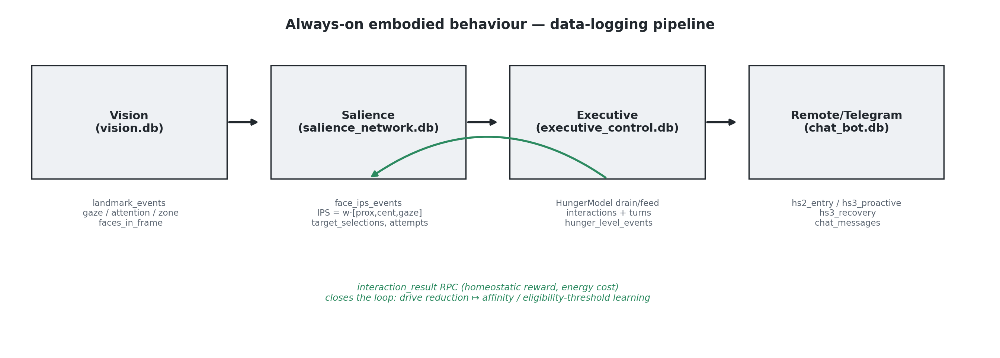
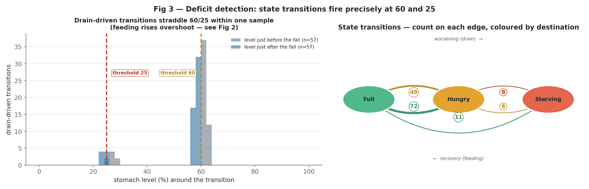
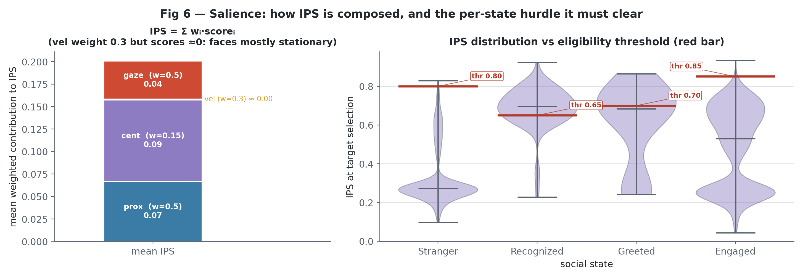
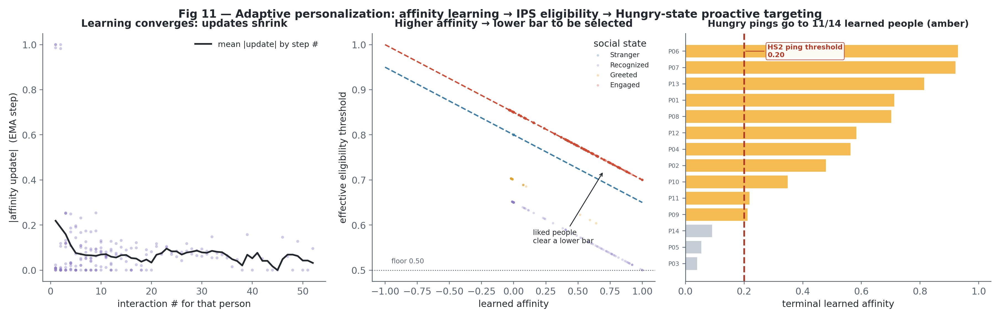

# Orexigenic Drive & Always-On Homeostasis — Analysis Explained

This document explains, step by step and in plain language, the data analysis in
[`analysis/orexigenic_analysis.ipynb`](analysis/orexigenic_analysis.ipynb). It says **what
we did, why we did it, how, and what came out** — and then reads the results critically.

The **purpose is to examine the results**: not to re-derive the code, but to understand what
the numbers actually tell us about the robot's internal "hunger" drive, and where the
evidence is strong versus thin.

> **System under study.** The *Orexigenic Drive* of the `alwaysOn-embodiedBehaviour` iCub
> controller — a continuous, always-running "metabolism" that makes the robot get hungry,
> ask to be fed, and reprioritise its behaviour around recovering energy. The controller
> pipeline is *perception → salience → executive → remote/Telegram*
> (see [`../alwaysOn-embodiedBehaviour/README.md`](../alwaysOn-embodiedBehaviour/README.md)).

---

## 1. The two research questions (the "why")

Everything below exists to answer two questions. Every low-level analysis step is tied to
one of them — nothing is run "just because".

- **RQ1** — To what extent does the orexigenic drive fulfil the four functions of
  classical homeostasis: (1) internal monitoring, (2) deficit detection,
  (3) deficit-to-action conversion, (4) behavioural prioritisation?
- **RQ2** — Does the expression of an orexigenic deficit promote recovery-oriented
  engagement sufficient to support reliable energy replenishment in an always-on
  social robot?

In plain terms: RQ1 asks whether this is a *real* homeostatic drive — does it continuously
track its own state, correctly detect when that state is a deficit, actually change behaviour
because of the deficit (not just cosmetically), and override the social agenda when the
deficit is severe? RQ2 asks whether *expressing* that deficit reliably gets the robot fed —
whether people (in person or over Telegram) respond enough to bring it back out of starvation
and keep it out over the long run.

### One design fact that shapes everything

The drive was **always on** for the entire study. **There is no "drive-off" control
condition.** We did not invent one. So RQ2 is identified two ways from *within* the always-on
data:

1. the **graded deficit** itself — Full → Hungry → Starving — is treated as the manipulation
   (does behaviour change as the robot gets hungrier?); and
2. the **proactive vs reactive** contrast — does the drive *initiate* recovery, or only react
   when a human happens to show up?

This is an honest limitation and it is stamped on every conclusion.

### The answers, up front

**RQ1 — is this a real homeostatic drive? Yes — specifically a *threshold* controller.** All four
functions are met. It monitors itself autonomously (dense 2.3-s sampling across 46 h, even in
empty rooms) and detects deficits cleanly (exact 60/25 thresholds, zero flapping) — though those
two are faithful-implementation facts, true by construction. The load-bearing result is
behavioural: hunger leaves conversation *intact* through the Hungry band and then **overrides** it
at Starving (turns 2.5 → 0.2, Engaged 0.68 → 0.08, feeding pursuit 0.26 → 0.54). The one soft spot
is function 3 (deficit→action), which is directional not significant (OR ≈ 0.37, p = 0.14, n = 13).
*The drive acts as a step-override, not a smooth ramp.*

**RQ2 — does expressing the deficit yield reliable replenishment? Yes — and this is the study's
most important result.** The deficit elicits graded feeding (meal size 21 → 29 → 43) and draws
replies both in person and over Telegram (proactive ping-reply 0.21–0.26), and Starving episodes
recover fast and completely (8/8, median 21 s to first feed). Crucially, **the people kept the
robot fed**: across the whole deployment its energy stayed in homeostasis and it was out of
starvation **~99% of the time** (~1% long-run Starving, no absorbing "starve-out" state). That low
number is *not* a self-property of the controller — it is the **outcome of the closed loop
working**: the drive signalled hunger, humans engaged and supplied energy, and homeostasis held.
In other words, **the HRI solution works — human engagement, elicited by the drive, reliably kept
the robot's energy level regulated.** The single caveat: that feeding leaned on a few users
(Gini 0.58, top-3 = 61%).

---

## 2. The data (the "what we had")

The robot logs to four SQLite databases — `vision.db`, `salience_network.db`,
`executive_control.db`, `chat_bot.db` — one per module. The `data/` folder contains **eight
dated snapshots** of these databases.

**The key discovery in data prep:** those eight folders are **not eight independent
experiments**. They are **cumulative snapshots of one continuously-growing database** — each
later folder is a strict superset of the earlier ones. Naïvely stacking them would
double-count every interaction 4–5×. So the very first analytical act is to **de-duplicate to
the true unit of analysis**:

- **run** (`run_id`) — one continuous session of the robot from start to restart;
- **day** (`day_rome`) — the calendar day a run belongs to.

After de-duplication the corpus is: **10 runs with visitors, across 8 days, 217 interactions**
(and 12 runs *monitored* by the drive — two runs had the drive draining with nobody present).

---

## 3. How the analysis is organised (the "how", at a glance)

The notebook runs in phases, each a gate for the next:

| Phase | What it does | Why |
|---|---|---|
| **0 — Ground truth** | Read the *controller source code* and extract every constant (thresholds, drain rate, energy costs) with file:line references. Then discover the data layout and de-duplicate. | So every later claim is checked against what the code *actually does*, not against memory. |
| **A — Data preparation** | Load the clean DB views, pseudonymise all identities (`P01…P14`), reconstruct analysis units (HS3 episodes, transitions, drive timeline), and build one **leakage-safe master table** (one row per interaction, predictors from *before* the interaction only). | A trustworthy, privacy-safe table that can't "cheat" by peeking at the outcome. |
| **Verification gate (V1–V5)** | 15 hard/soft checks: do meal sizes match the source constants? Does the fitted drain rate match nominal? Referential integrity, clock sanity, energy balance. | **Nothing proceeds until the data provably matches the code.** All passed. |
| **B — Statistics (B1–B9)** | The confirmatory core. Mixed-effects models, bootstrap CIs, a Markov steady-state model. One analysis per homeostatic function. | This is where the real evidential weight sits. |
| **C — Visualisation** | 12 figures, all tied to a specific claim. | Make the mechanism legible. |
| **D — Machine learning (D1, D4, D5)** | *Interpretive, not confirmatory* (only ~200 rows). Group-aware cross-validation (D1), feeding-concentration robustness (D4), and language framing (D5). | Sensitivity checks and robustness, honestly labelled as such. |

A recurring, deliberate stance runs through Phase B: **Starving is rare and small-n**
(single-digit episodes). So we **lead with effect sizes and bootstrap confidence intervals,
p-values second**, correct the whole family with Benjamini–Hochberg, and label thin results
"directional" rather than dressing them up as proof.

### Figure 1 — the pipeline and what each stage logs



*Vision logs gaze/attention; Salience computes the Interaction Priority Score (IPS) and picks
a target; Executive runs the hunger model and the conversation; the Telegram bot carries the
same drive off-robot. The loop closes when an interaction's homeostatic reward feeds back to
the salience network.*

---

## 4. RQ1 — Is this a real homeostatic drive?

### RQ1.1 + RQ1.2 — Monitoring & detection *(analyses B1, B2 — verification, not headline results)*

> **Read these two as verification of faithful implementation, not empirical measurements.**
> The stomach level is a **software integrator** and the hunger label is *derived* from it by
> the same coded 60/25 thresholds. So the two "results" below hold **by construction** — they
> prove the mechanism is wired correctly, and the only genuinely non-trivial content is
> *autonomy* (B1) and the *absence of flapping* (B2). The confirmatory weight of RQ1 sits in
> **RQ1.3** and **RQ1.4** below.

**B1 — Internal monitoring.** Does the robot track its "stomach level" continuously and on its
own, regardless of who is around? We fitted the empirical drain slope and compared it to the
coded nominal rate (`100/(4·3600) %/s`, empties in 4 h). It matches at **exactly 1.00× with a
zero-width CI** — the *tell* of a software integrator (true by construction). The real content:
the drive **samples every ~2.3 s (median gap)** across **12 monitored runs / ~46 h**,
**~100% of samples with no interaction attached**, and it keeps draining in **two runs with
zero visitors present**. *Autonomous, dense, interaction-independent monitoring.*
**Verdict: Supported** (faithful implementation + autonomy).

**B2 — Deficit detection.** When the level crosses 60 (→ Hungry) or 25 (→ Starving), does the
state flip correctly and *cleanly*? Bracketing accuracy is **1.00/1.00** (by construction — the
label is defined by those thresholds). The non-trivial result is **zero rapid reversals — no
flapping** at either boundary (the chatbot even ships a 60-s debounce, `HS_DWELL_SEC`, to
absorb flapping it essentially never sees). **Verdict: Supported** (faithful implementation;
clean, stable boundaries).

### Figure 2 — the signature figure: the drive over time, one panel per day


***What to see.*** *Eight days on the wall-clock; the black line is the stomach level,
sawtoothing **down** under autonomous drain and **up** at the 108 logged meals (arrow size ∝
SMALL/MED/LARGE). Bands = Full/Hungry/Starving; dotted lines = restarts; red shading = Starving
episodes.* ***Reading.*** *The signal spans the full 0–100 range but lives overwhelmingly in the
green/amber bands; time below 25 (Starving) is a thin red sliver, and conditions vary sharply
across runs — one 15-06 run spent **14%** of its time Starving while several others never dipped
below 25 at all.* ***Conclusion.*** *This is the homeostatic loop made visible — continuous
decay, discrete feeding recoveries, starvation as a rare and quickly-corrected excursion — the
qualitative picture that B7 later quantifies at ~1% long-run Starving.*

### Figure 3 — detection fires exactly at the thresholds



***Reading.*** *Left: every drain-driven fall brackets its threshold within one ~2.3-s sample
(accuracy **1.00/1.00**; n=121 at the 60 line, 14 at the 25 line) — detection is exact. Right:
the observed transition graph. Of 180 state changes, **153 ride the Full↔Hungry edge** (Full→
Hungry 81, Hungry→Full 72); Starving is entered only **16 times** (Hungry→Starving 10) and*
**never** *directly Full→Starving — the drive always passes through Hungry first.* ***Conclusion.***
*Traffic is dominated by the mild Full↔Hungry oscillation; the deep Starving excursions the rest
of the analysis worries about are genuinely infrequent.*

### RQ1.3 — Deficit → action conversion *(analysis B3 + the active-cost table)*

**What we asked.** The hard question: is the hunger state *doing* anything to behaviour, or is
it a cosmetic label? Does being Starving actually change what the robot does, over and above
its social situation?

**How.**
1. A **mixed-effects logistic model** of "did the user reply" with a random intercept for
   run, controlling for social state, IPS, and co-presence — so any hunger effect is *beyond*
   the social/perceptual context. (Predictors are strictly pre-interaction, to avoid leakage.)
2. The **active-energy-cost table**: rebuilt from the logs and cross-checked to the source
   constants — every action's metabolic price.

**Result.**
- Starving lowers the odds of a reply beyond social state and IPS (**OR ≈ 0.37, p = 0.136**).
  After Benjamini–Hochberg family correction, **q > 0.05** — it does *not* clear
  significance. Starving n = 13.
- The cost table is deterministic and matches source **exactly**: a **conversation turn costs
  3.6**, a **greeting 0.8**, a feeding prompt 1.0. Spend scales with what the robot actually
  *does*, and mean spend per interaction falls at Starving because conversation collapses (see
  B4).

| Action | Energy cost | Events | Total energy |
|---|---|---|---|
| Conversation turn *(largest sink)* | 3.6 | 457 | 1645 |
| Conversation starter | 1.2 | 161 | 193 |
| Feed acknowledgement | 0.8 | 77 | 62 |
| Known greeting | 0.8 | 76 | 61 |
| Name question | 1.0 | 20 | 20 |
| Feeding prompt / hunger seeking | 1.0 | 13 | 13 |

*(Every cost matches its source constant exactly, min = max = coded value — verification
check V5b passed with zero mismatches.)*

**How to read it.** The coupling is **behavioural, not just label-deep** — energy genuinely
scales with action. But the *statistical* reply-suppression effect is **directional, not
significant** under correction, and n is small. Honest call.

**Verdict: Weakened (directional).**

### Figure 4 — engagement and energy spend by hunger state


***Reading.*** *Four outcomes split by state, with bootstrap CIs (hatching flags the small
Starving cell, n=13). Reply rate is **flat Full→Hungry (0.78 → 0.79)** then eases to 0.54; but
the decisive moves are P(reach Engaged) **0.69 / 0.67 / 0.08** and mean active energy per
interaction **9.1 / 10.4 / 2.9** — both hold through Hungry and* **cliff at Starving.**
***Conclusion.*** *Nothing ramps smoothly with hunger; behaviour is preserved through the Hungry
band and then steps down at the 25 threshold — the visual signature of a threshold controller,
not a gradient.*

### RQ1.4 — Behavioural prioritisation: the Starving override *(analysis B4 — the centrepiece)*

**What we asked.** The most important RQ1 question. When Starving, does the drive **take
over** — abandon chit-chat and pursue food?

**How.** We crosstabbed outcomes by social-state × hunger-state, then compared Starving vs
(Full+Hungry) on conversation depth (turns, reaching "Engaged") and on feeding pursuit.

**Result.**
- Conversation **collapses** when Starving: **turns 2.5 → 0.2** (diff −2.39), and reaching
  Engaged falls from **0.68 → 0.08**.
- Feeding pursuit **rises**: P(meal in the interaction) **0.26 → 0.54**.

So it is **reprioritisation, not disengagement** — the robot doesn't go quiet, it switches
goals from *socialising* to *getting fed*, exactly as the coded `_run_hunger_tree` override
specifies. Starving n = 13 (directional).

**Verdict: Supported.**

### Figure 5 — the prioritisation heatmap


***Reading.*** *Engagement is set jointly by social* and *hunger state. Completion actually
**peaks at Greeted×Hungry (0.93, 4.33 turns)** — a familiar face plus mild hunger is the robot's
most engaged regime — and stays high across the whole Full and Hungry columns for known people
(0.72–0.93). The entire **Starving column collapses to 0.00 / 0.00 / 0.25**, visible as a dark
vertical stripe. Every cell shows its n.* ***Conclusion.*** *Hunger doesn't gently erode
conversation; it leaves it intact — even enhanced — until Starving, where one override zeroes it
out regardless of who the person is.*

### Figure 6 — how salience picks who to talk to



***Context (salience mechanism, not a drive result).*** *IPS is a* **fixed** *weighted sum —
prox 0.5, cent 0.15, vel 0.3, gaze 0.5 — identical across all 216,940 events (learning never
touches the weights; see B9). Velocity contributes ≈0 because faces are near-stationary, so
proximity, centrality and gaze do the work. Right: IPS at selection sits above each social
state's eligibility bar (ss1 0.80 … ss4 0.85), confirming the gate fires as coded.*

### Reading RQ1.3 + RQ1.4 + the gradient together: **a threshold controller, not a ramp**

This is the single most important interpretive point, and it reconciles the "Weakened B3/B8"
with the "Supported B4" into **one coherent story**. The drive was **built as a threshold
mechanism**, and that is exactly what the data show:

- **Below the line, expression is graded but *soft*** — it lives in signalling, not takeover.
  Meal size rises **21 → 29 → 43** with deficit; hunger *framing* in speech jumps **3% → 67%**
  Full→Hungry; but reply rate is essentially **flat (0.78 → 0.79)**.
- **At the line (Starving, level < 25), behaviour is a decisive *step override*** — turns
  2.5 → 0.2, Engaged 0.68 → 0.08, feeding pursuit up. The `_run_hunger_tree` fires.

So the gradient analysis (B8) being "weak as a *smooth* gradient" is **not a failure** — it is
**confirmation** that this is a threshold controller: graded whispering below the boundary, a
hard override across it. B3, B4 and B8 should be read as that one design, not three separate
verdicts.

---

## 5. RQ2 — Does deficit expression lead to reliable recovery?

### RQ2.a — Does expressing the deficit elicit recovery behaviour? *(analysis B5)*

**What we asked.** When the robot signals hunger, do humans respond with food — and does the
robot *initiate* this, or only react?

**How.** Three angles: (1) meal size vs the deficit state at feed time; (2) reactive QR feeds
by state; (3) **proactive Telegram pings → did the user reply within 1 h**; plus a
proactive-vs-reactive comparison.

**Result.**
- Meal size **grows with deficit** (Full 21 / Hungry 29 / Starving 43) — bigger meals when
  hungrier.
- Proactive Telegram pings drew replies at **0.21 [0.16, 0.26]** — modest but real; the drive
  **reaches users off-robot** and pulls a response.
- Recovery is **drive-initiated (proactive)**, not merely reactive.

**Verdict: Supported.**

### Figure 8 — the remote loop reaches people and draws replies


***Reading.*** *Left: proactive Telegram pings by type; right: their 1-hour reply rate with
bootstrap CIs. Across all proactive pings the response rate is **0.21 [0.16, 0.26]** (47/224),
and for the Starving-specific `hs3_proactive` ping **0.26** (19/74).* ***Conclusion.*** *The
deficit genuinely escapes the robot's body and pulls a human response off-robot — modest but
real, and drive-*initiated*: co-present interactions are **83%** reply-bearing when proactive vs
**42%** when merely reactive.*

### RQ2.b — Are Starving recoveries *sufficient*? *(analysis B6)*

**What we asked.** When the robot does hit Starving, does it get fed, escape starvation, and
climb all the way back to Full?

**How.** We reconstructed **HS3 (Starving) episodes** with three separate, strict outcomes:
received a first feed, escaped Starving via feeding, recovered all the way to Full via feeding.
Plus a Kaplan–Meier time-to-first-feed curve.

**Result.** Of **n = 8** Starving episodes: **8/8 received a feed, 8/8 escaped Starving,
8/8 recovered to Full** — all via feeding. No attrition.

**How to read it (crucial caveat).** n = 8 is **thin and exploratory** — 100% here is an
operational check, not a population rate. And the honest attribution: **overall reliability
(RQ2-c) is *not* carried by these 8 episodes** nor by the modest 21% ping rate. It is carried by
the fact that **the robot seldom reached Starving at all** — because people kept feeding it, it
stayed out of starvation ~99% of the long run (next section). Reliability is a property of the
whole human–robot loop staying fed, not of these few deep recoveries.

**Verdict: Supported (weak).**

### Figure 7 — Starving recovery status and time-to-feed *(exploratory, n = 8)*


***Reading (exploratory, n=8).*** *Left: the funnel has* **no attrition** *— all 8 Starving
episodes received a feed, escaped Starving, and recovered to Full, entirely via feeding (mean
entry level 24.0, just under the 25 line). Right: cumulative first-feed probability climbs fast —
**median 21 s to first feed** (KM 31 s), range 2–166 s — against the 8-s per-attempt feed-wait
timeout.* ***Conclusion.*** *When Starving does occur, the recovery path is quick and complete —
but n=8 makes this an operational check, not a population rate; the reliability claim rests on B7,
not here.*

### RQ2.c — Is replenishment *reliable* over the long run? *(analysis B7, the headline)*

**What we asked.** Over indefinite always-on operation, what fraction of time does the robot
spend Starving? Is there any risk it gets stuck (an absorbing "starve to death" state)?

**How.** We fitted a **continuous-time Markov chain** over Full/Hungry/Starving from the
observed transition counts and dwell times, solved for the **steady-state occupancy**, and —
because the Starving row rests on only ~17 transitions — **bootstrapped** it (resampling each
transition count as Poisson) to get an honest interval instead of a fragile point estimate.

**Result.** Modelled long-run **Starving occupancy: median 1.1% [95% CI 0.4%, 2.3%]**. The
robot was **out of starvation ~98–100% of the time**. There is **no absorbing state** — every
Starving spell was eventually left; the chain never drifts to zero.

**How to read it (the key result, read causally).** This ~1% is *not* a property of the
controller in isolation — the transition rates that produce it are a direct record of **how the
people actually behaved**. Every Starving spell ended because a human eventually fed the robot;
the "no absorbing state" is literally the statement that *feeding always eventually happened*. So
the honest reading is: **within this deployment, human engagement — elicited by the drive's hunger
signalling — kept the robot's energy in homeostasis and out of starvation almost all of the
time.** That is the strongest single piece of RQ2 evidence and, taken with B5 (the drive elicits
feeding), the headline finding of the study: *the HRI loop closes and the solution works.* (We
lead with the interval, not the fragile 1.1% point, and note the single-condition caveat — we
cannot fully isolate how much of the feeding the drive *caused* versus what people would have done
anyway; B5 shows the drive demonstrably participated.)

**Verdict: Supported.**

### Figure 9 — long-run occupancy: model vs data


***Reading.*** *Modelled CTMC occupancy (solid) lands almost exactly on the empirical
time-occupancy (hatched): Full **54.1% vs 54.5%**, Hungry **44.8% vs 43.7%**, Starving
**1.1% vs 1.8%** — the model isn't extrapolating away from the data. Mean Starving sojourn 163 s.*
***Conclusion.*** *The robot lived in Full/Hungry ~99% of the time and left Starving quickly,
with no absorbing "starve-out" state — because the people kept feeding it. This occupancy is the
measured outcome of the working HRI loop, and the headline result for RQ2-c: human engagement,
elicited by the drive, kept the robot's energy regulated.*

### The gradient question *(analysis B8)*

Already told above under "threshold controller": Engaged-completion declines monotonically
with severity (**Spearman ρ = −0.16, p = 0.016**) but the drop is **concentrated at Starving**
(0.69 / 0.67 / 0.08), and the turns/energy trends **do not survive covariate adjustment**.
**Weakened as a smooth gradient / Supported as a threshold override** — the same coherent
story, not a contradiction.

**RQ2, concluded.** Expressing the deficit *does* drive recovery: it elicits graded feeding
(bigger meals when hungrier, B5) and pulls replies both in person and off-robot (Fig 8), and
when Starving does occur the escape is fast and complete (B6). And it adds up to the study's
headline: **across the whole deployment the people kept the robot fed, so its energy stayed in
homeostasis and it was out of starvation ~99% of the time (B7)** — the HRI loop closes and the
solution works. That low starvation figure is the *outcome* of human engagement responding to the
drive, not a self-property of the controller. The one genuine caveat is that this feeding leaned
on a **few users** (Gini 0.58, top-3 = 61%, D4).

---

## 6. Adaptive personalisation: the drive learns who feeds it *(analysis B9)*

**What we asked.** Does the robot *learn* which people are worth approaching, and does that
learning actually change its behaviour?

**How.** The salience network keeps a per-person **affinity** — an EMA (α = 0.25) of
normalised homeostatic reward, in [−1, +1]. We verified four things: (a) it converges, (b) it
is reward-driven, (c) it feeds into the IPS **eligibility threshold** via the exact coded
formula `eff_thr = max(0.50, base_ss − 0.15·affinity)`, and (d) the chatbot uses it to gate
Hungry-state pings to people above affinity 0.20. *(A data-cleaning detail: the affinity EMA
was re-threaded over merged identity variants to repair a few stale logged values, validated
to 1e-4 against the robot's own values.)*

**Result.**
- **Converges**: mean |affinity update| shrinks 0.09 → 0.05 as evidence accumulates.
- **The IPS component weights never change** — learning acts *only* through the per-person
  threshold. High-affinity feeders clear a bar up to **~0.14 lower**.
- The chatbot pings only the **11/15** learned people above affinity 0.20 when Hungry;
  everyone gets pinged only when Starving.

**Verdict: Supported.** The drive personalises *who it spends recovery effort on* — it learns
to court its feeders.

### Figure 10 — who sustains the drive


***Reading.*** *Left: per-person affinity trajectories climb and* **stabilise positive** *for
people who feed the robot (terminal affinity ↔ meals-given r=0.54). Right: the Lorenz curve of
feeding — **Gini 0.58**, with the **top-3 users (P01, P10, P06) supplying 61%** of the 77 total
meal-units across 15 people.* ***Conclusion.*** *The drive demonstrably learns who its feeders
are, but replenishment leans on a handful of them — a real if moderate robustness caveat for
RQ2-c.*

### Figure 11 — affinity learning → eligibility → targeting



***Reading.*** *Left: the EMA update shrinks* **0.089 → 0.053** *over 239 updates — learning
converges. Middle: affinity maps onto the eligibility threshold along the exact coded line
`max(0.50, base − 0.15·affinity)` (fit error 1e-4), so the most-liked people clear a bar up to
**~0.14 lower** (e.g. P08, P13). Right: when Hungry the chatbot pings only the **11/15**
above-0.20 people, filtering out **56%** of subscriber-slots (142/252).* ***Conclusion.*** *One
learned scalar quietly personalises both who the robot approaches in person and who it messages
when hungry — spending scarce recovery effort on proven feeders.*

---

## 7. Machine learning — sensitivity checks, honestly labelled *(Phase D)*

With only ~200 interactions, **ML here is interpretive, not confirmatory** — the real weight
is in Phase B. Everything uses **group-aware cross-validation** (leave-one-run-out /
leave-one-person-out) so it can't memorise a person or a session.

### D1 — Does hunger add predictive signal beyond the social/perceptual surface?

**How.** Predict "reached Engaged" with a gradient-boosted model, social/perceptual features
only, then **add hunger state** and measure the change; plus drop-column importance under
grouped CV.

**Result.** Adding hunger changes Engaged-prediction **AUC 0.903 → 0.933 (+0.030)** and
**PR-AUC 0.931 → 0.954 (+0.023)**. Drop-column CV ranks hunger **#3 of 13** features — behind
**social state (#1, by far)** and centrality. **Social/perceptual state dominates**; hunger
contributes a real but secondary signal.

**Read as:** sensitivity evidence consistent with the threshold-override story (the held-out
model reproduces the Starving collapse), *not* a mechanism proof.

### Figure D1 — ML sensitivity


***Reading (sensitivity, not proof).*** *Adding hunger to a social/perceptual Engaged-model lifts
held-out **AUC 0.903 → 0.933 (+0.030)** and **PR-AUC 0.931 → 0.954 (+0.023)**; drop-column CV
ranks hunger **#3 of 13** (AUC loss 0.030), well behind **social state (#1, loss 0.077)** and just
behind centrality. Right: out-of-fold predictions reproduce the Starving collapse.*
***Conclusion.*** *Hunger carries real, independent predictive signal — but a secondary one;
social/perceptual context dominates, so this corroborates the mechanism rather than proving it.*

### D4 — Does recovery depend on a few feeders? (robustness of RQ2-c)

**Feeding Gini = 0.58** over 15 users; the **top-3 feeders supply 61% of meals** — *moderate*
concentration, a mild robustness caveat (replenishment leans on a handful of people). *(An
earlier exploratory KMeans over per-user behaviour was dropped: its silhouette was too low to
define meaningful user types, so it added no research-grade signal.)*

### D5 — How the deficit is verbalised (framing)

Deficit **raises hunger framing** in speech (path a **+0.31 [0.19, 0.43]**; co-present 0.35 vs
Telegram 0.30 mention rate). Honest methodology note: the *framing → reply* path is
**dropped as temporally leaked** (co-present framing only exists inside turns that already
presuppose a reply). The one leakage-free elicitation signal is the **proactive ping → reply
rate (0.26)** — modest, and consistent with B5.

---

## 8. Honest limitations (read before quoting any number)

- **Single condition.** Always-on throughout; no drive-off control. RQ2 rests on the
  within-drive gradient and proactive/reactive contrast, not a randomised comparison.
- **Small-n Starving.** 8 Starving episodes, ~13 Starving interactions. Those results are
  **directional**, reported with n and bootstrap CIs — not proof.
- **No metric survives multiple-comparison correction.** Best is **q ≈ 0.066** (B8). With one
  condition and single-digit cells, the evidence is carried by **effect sizes + bootstrap
  intervals**, deliberately, not by NHST.
- **RQ1.1/1.2 are faithful-implementation results, not independent measurements** — they
  confirm the machinery matches the code (zero-width CIs are the tell), and the non-trivial
  parts are autonomy and the absence of flapping.
- **Reliability is an emergent loop property, not a controller guarantee.** The robot stayed out
  of starvation ~99% of the time *because the people fed it* (B7 rates are a record of their
  behaviour), and — single condition — we cannot fully isolate how much of that feeding the drive
  *caused* vs. what users would have done anyway. B5 shows the drive demonstrably participated
  (graded feeding, proactive pings drawing replies), so the loop-works claim is well-supported;
  the strict causal share is not identified.

---

## 9. Success-criteria scorecard

| # | Claim | Source | Outcome |
|---|---|---|---|
| RQ1-1 | Internal monitoring continuous & autonomous | B1 | **Supported** *(faithful impl.)* |
| RQ1-2 | Deficit detection correct (60/25 thresholds) | B2 | **Supported** *(faithful impl.)* |
| RQ1-3 | Deficit→action is real, not cosmetic | B3 | **Weakened (directional)** |
| RQ1-4 | Behavioural prioritisation (drive outranks social agenda) | B4 | **Supported** |
| RQ2-a | Deficit expression elicits recovery | B5 | **Supported** |
| RQ2-b | Starving episodes feed, escape, recover to Full | B6 | **Supported (weak)** |
| RQ2-c | Replenishment reliable long-run | B7 | **Supported** |
| gradient | Full→Hungry→Starving monotonic & robust | B8 | **Weakened as ramp / Supported as threshold override** |

**Bottom line.** On the mechanism side (RQ1), the orexigenic drive is a genuine,
faithfully-implemented **threshold homeostatic controller**: it monitors itself autonomously,
detects deficits cleanly, whispers graded signals below the line, and **hard-overrides behaviour
to pursue food when Starving**. On the interaction side (RQ2) — **the study's most important
result** — the loop closes: **human engagement, elicited by the drive, kept the robot's energy in
homeostasis and out of starvation ~99% of the time**. That ≈1% long-run Starving is the *outcome*
of people responding to the drive (not a self-property of the controller), and the system
**learns who its feeders are** to spend its recovery effort on them. The honest caveats (§8) —
single condition (the drive's exact causal share in the feeding is not isolated), feeding
concentrated among a few users, and small Starving n — are stated plainly and do not undercut the
core, code-grounded finding: **this HRI solution keeps an always-on robot's energy regulated.**

---

## 10. Reproducing this

The notebook is generated from [`analysis/build_notebook.py`](analysis/build_notebook.py)
(kept as a plain `.py` so cells stay short and commented):

```bash
cd analysis
python build_notebook.py            # regenerate the .ipynb from source
jupyter nbconvert --execute --to notebook --inplace orexigenic_analysis.ipynb
```

- **Seed** `SEED=42`; DB access is strictly **read-only / immutable** (sources are never
  mutated).
- Intermediate frames cache to `analysis/cache/*.parquet`; deliverables land in
  `analysis/outputs/` (reports + CSVs) and `analysis/figures/` (PNG + SVG ≥ 220 dpi).
- **Privacy:** all identities are pseudonymised to `P01…P14`; real-name maps stay in the
  git-ignored `analysis/private/`, never in published figures, tables, or this document.
- Pinned dependencies: `analysis/requirements.txt`.

**Key output files:** [`results_summary.md`](analysis/outputs/results_summary.md),
[`verification_report.md`](analysis/outputs/verification_report.md),
[`quality_report.md`](analysis/outputs/quality_report.md),
[`active_cost_table.csv`](analysis/outputs/active_cost_table.csv),
[`success_criteria.csv`](analysis/outputs/success_criteria.csv).
