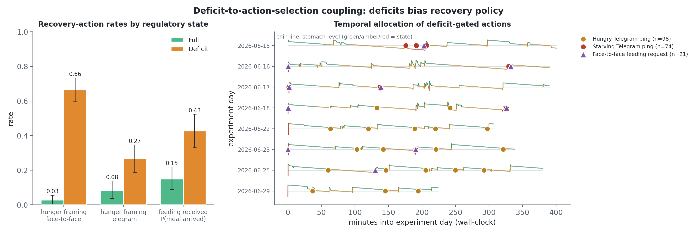
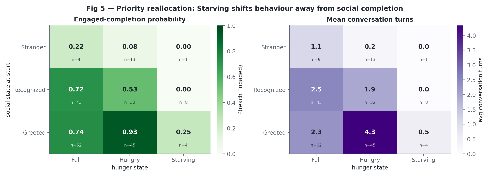
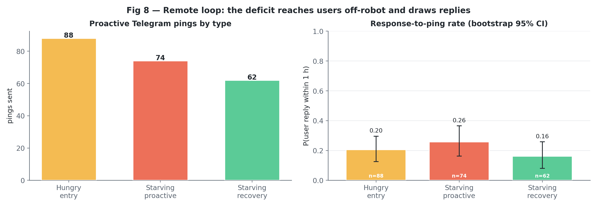
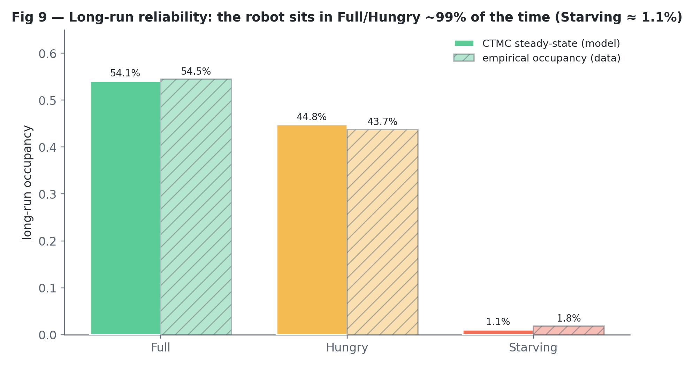
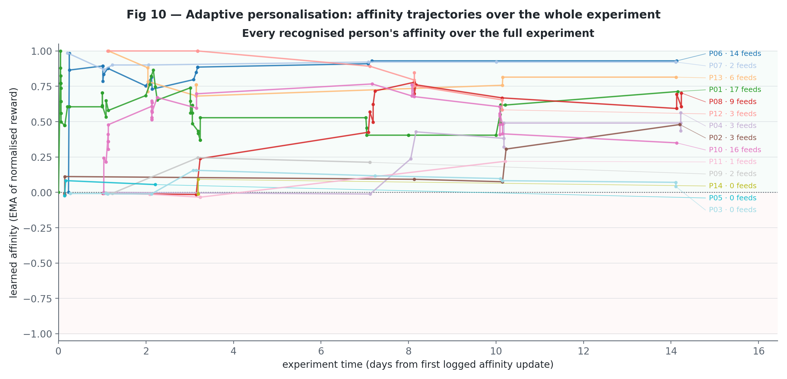
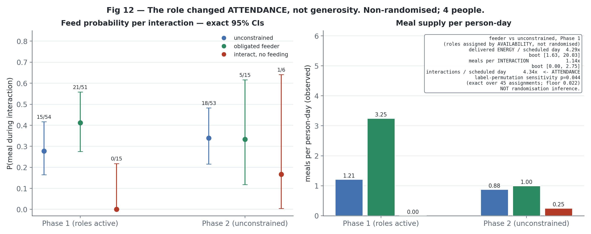
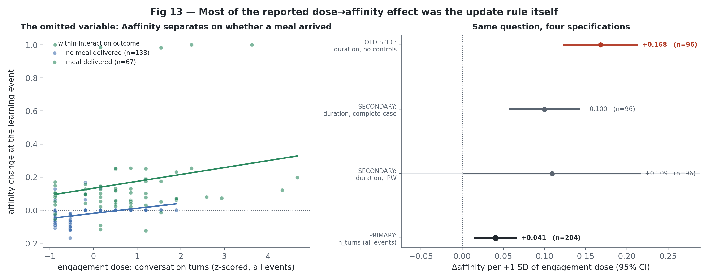
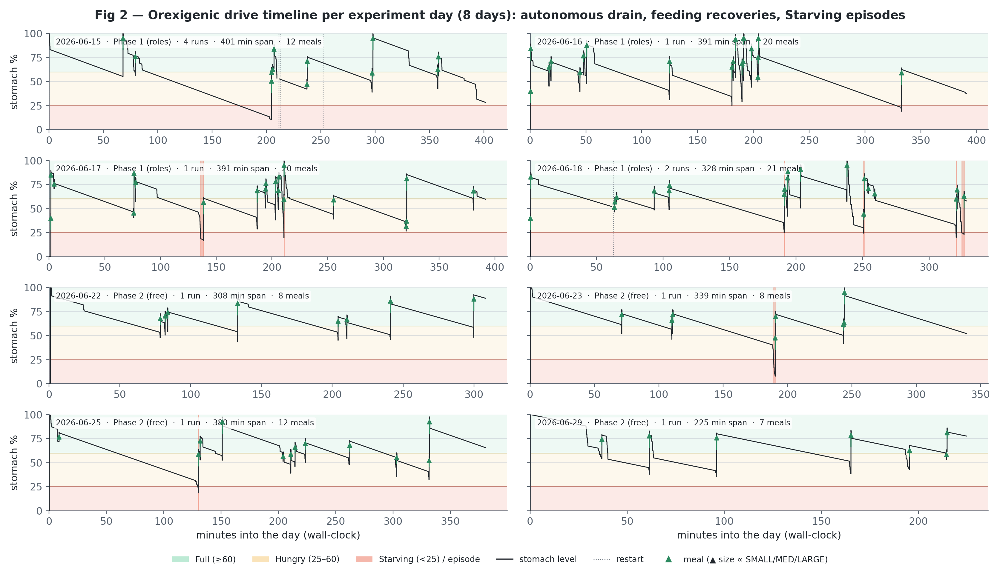

# Orexigenic Drive and Always-On Homeostatic Regulation

This report explains the analysis in
[`analysis/orexigenic_analysis.ipynb`](analysis/orexigenic_analysis.ipynb). Every number below is
read from the regenerated artifacts in [`analysis/outputs/`](analysis/outputs/); none is typed by
hand, and a test asserts that every p-value quoted here appears in the multiplicity ledger.

The system under study is the *Orexigenic Drive* in the `social-robot-embodied-behaviour-architecture`
iCub controller. The drive tracks internal energy, detects hunger states, changes the robot's
behaviour when energy is low, and uses social and remote interaction to seek replenishment. The
controller pipeline is:

`perception -> salience -> executive regulation -> remote/Telegram signalling`.

## Contents

**Part I — Summary**

1. [Main findings](#1-main-findings)

**Part II — Background and methods**

2. [Research questions and study design](#2-research-questions-and-study-design)
3. [Data and analysis pipeline](#3-data-and-analysis-pipeline)
4. [How to read the statistics](#4-how-to-read-the-statistics)

**Part III — Results**

5. [RQ1: Does a deficit change behaviour?](#5-rq1-does-a-deficit-change-behaviour)
6. [RQ2: Does deficit expression close the recovery loop?](#6-rq2-does-deficit-expression-close-the-recovery-loop)
7. [RQ3: Does adaptive regulatory memory encode behaviour?](#7-rq3-does-adaptive-regulatory-memory-encode-behaviour)
8. [Machine-learning sensitivity check](#8-machine-learning-sensitivity-check)

**Part IV — Synthesis**

9. [Scorecard and synthesis](#9-scorecard-and-synthesis)

**Part V — Appendix**

- [Appendix A: Instrumentation verification](#appendix-a-instrumentation-verification)

---

## Part I — Summary

### 1. Main findings

Every result below carries exactly one **evidence class**, and the classes are not interchangeable:

| Class | Meaning |
|---|---|
| `Implementation verification` | Follows from the controller source. Confirms the code is faithfully implemented and logged. **Not a discovered fact.** |
| `Within-deployment association` | A cluster-aware association in this deployment. **Not causal, not a population estimate.** |
| `Exploratory observation` | Descriptive. Too small-n or too selection-prone to support inference. |
| `Inconclusive` | The analysis ran and did not settle the question. |
| `Requires replication` | Suggestive; identification needs new data. |

Three structural facts govern everything below. **The drive was always on** — there is no
drive-off condition, so nothing here identifies a causal effect of the drive. **Roles were not
randomised** — the Phase-1 feeder / no-feed roles were assigned **by participant availability**, so
there is no randomisation inference in this report; a label-permutation *sensitivity* is reported
instead, over the exact enumeration of all possible assignments, and is labelled as such.
**Affinity is a deterministic EMA of delivered energy** — it cannot drift and cannot encode
anything else, so analyses of it are implementation verification, not evidence that the robot
"learns".

**RQ1's behavioural coupling is the strongest result.** When the robot is in deficit (energy below
60), the odds that a meal arrives during an interaction are **5.3x** higher than at Full
(person-cluster bootstrap **[2.8, 9.0]**; run-cluster [2.6, 7.1]; leave-one-person-out 4.4–6.5). It
**survives** the prespecified adjustment for social state, trigger mode, day and prior interaction
count, under both clustering schemes (adjusted OR 5.4 and 5.7) — an association within a single
always-on deployment, not a causal effect. Meal size also scales with deficit severity: Full 21 →
Hungry 29 → Starving 43 stomach points, **+10.9 per deficit step** (run-cluster bootstrap [+6.2,
+14.0]), surviving exclusion of the two obligated feeders (+7.1/step, [+2.0, +12.2]).

**RQ2's recovery loop is real, and weak.** The remote channel works: with reply-centric matching
and "thanks, I'm full" notifications excluded, and using the 15-minute window — the only one where
every ping actually got a matched control (100% coverage) — a hunger ping draws a reply **+0.10**
more often than a matched control (subscriber-cluster bootstrap [+0.06, +0.14]). Wider windows
show a larger gap (+0.17 at 30 min, +0.22 at 60 min) but match progressively fewer pings to a
control (74%, then 39%), so those are reported as sensitivity checks, not the headline. The robot
starves in **17** distinct episodes, of which **13/17** recover to Full by feeding (exact [0.50,
0.93]). The longest ran **30 minutes** down to level 10.5 in a run with 15 logged interactions:
people were present, and the robot was not fed. **Long-run reliability is not established**: the
robot spent 1.67% of observed seconds in Starving (assumption-free, run-cluster bootstrap [0.38%,
4.04%]) — that figure stands on its own — but a modelled stationary occupancy does not, because
Starving occupancy differs ~9x between Phase 1 and Phase 2, so a time-homogeneous chain fitted
across both describes neither.

**RQ3's central mechanism claim is the source code restated, and the human finding is about
exposure, not learning.** Affinity's four programmed inputs (`credit`, `active_energy_cost`, `fed`,
`affinity_before`) explain **R² = 0.45** of every update. Controlling for `credit` and
`active_energy_cost` directly — the strictest test, since `active_energy_cost` is a literal term
in `credit` — leaves a sign-reversed, near-zero residual dose effect (**−0.093**/SD); this is not
read as a magnitude, because `active_energy_cost` is mechanically *caused by* engagement dose, so
conditioning on it strips out the pathway being measured, not just the circularity. The
`n_turns`-dose specification that instead controls `fed` and `affinity_before` (but deliberately
not `active_energy_cost`, for that reason) gives **+0.041**, against **+0.168** with no controls at
all — same sign, **4.1x apart**, so the two do **not** agree, and neither of them is "the fully
rule-controlled" figure. What RQ3 does establish is about the humans: on the complete
scheduled-day panel (96 scheduled person-days — reconciled against the robot's own interaction
logs first, which reclassified 10 sheet-marked absences as attended — leaving 23 genuine no-show
zeros), **4.3x the energy arrived during interactions attributed to** obligated-feeder participants
per scheduled day (bootstrap [1.6, 20.0]), but **per interaction they were credited with feeding
only 1.1x as often** ([0.0, 2.8]). "Attributed to" is deliberate: feeds are assigned to whichever
interaction was active when the energy arrived, not to an independently verified feeder identity
(`feeder_face_id` names only 8 of 14 recipients). The gap is **exposure**, not per-encounter
generosity — but exposure itself is not just "showed up more": it decomposes into **1.7x** higher
attendance *probability* (feeders attended every scheduled day) and **2.6x** more interactions
*per day they attended*, both of which multiply to the 4.3x headline. Being told to feed the robot
made people visit more reliably *and* stay more engaged once there; it does not show they were
more generous once there.

The main limitation is scope: this is one robot, one site, 8 session-days, 12 monitored runs, and
14 named people. The results are within-deployment evidence for this human-robot regulatory loop,
not population estimates across robots, sites, or user groups.

---

## Part II — Background and methods

### 2. Research questions and study design

The study asks three connected questions.

- **RQ1** — To what extent does the orexigenic drive instantiate the four operational functions
  of classical homeostasis: (1) internal monitoring, (2) deficit detection,
  (3) deficit-to-action-selection coupling, (4) behavioural priority reallocation?
- **RQ2** — Does expressing an orexigenic deficit promote recovery-oriented engagement
  sufficient to support reliable energy replenishment in an always-on social robot?
- **RQ3** — Does the robot's adaptive regulatory memory of past interactions reflect participants'
  behaviour, and does that memory influence how the robot engages with people later?

For RQ1, the first two functions are software verification checks; the empirical question is
whether the internal deficit state changes behaviour. For RQ2, the key issue is whether hunger
signals lead to human engagement and feeding often enough to avoid persistent starvation. For RQ3,
the question splits in two: whether the robot's **adaptive regulatory memory** (the per-person
homeostatic affinity) encodes anything beyond its own programmed update rule, and whether the
Phase-1 role manipulation reveals something about how people, rather than the controller, behave.

Two design facts shape the analysis and cannot be analysed away.

**The drive was always on.** There is no off-switch control condition. RQ2 is therefore identified
within the always-on deployment by comparing behaviour across energy states: Full, Hungry, and
Starving.

**The study had two 4-day phases, and Phase-1 roles were assigned by availability, not
randomised.** Two participants were obligated feeders, two were asked to interact but never feed,
and all others were unconstrained; in Phase 2 all constraints were lifted. Because roles were
assigned by who was available rather than by a random draw, and because each controlled role has
only 2 people, role contrasts are reported as **exploratory** manipulation checks with a
label-permutation sensitivity — never as randomisation inference, and never as population-level
estimates.

The evidence is ordered as follows:

1. **RQ1 behavioural coupling.** Deficit and Starving states change action selection and
   feeding received — the strongest, best-identified result in the report.
2. **RQ2 recovery loop.** Meal size, the remote reply channel, and Starving-episode outcomes,
   followed by the withdrawn long-run reliability claim.
3. **RQ3 mechanism and role manipulation.** Whether affinity encodes anything beyond its own
   update rule, and what the role manipulation actually shows about attendance.
4. **RQ3 downstream expression**, decomposed into its three logged stages.
5. **Appendix checks.** Monitoring and threshold detection verify the instrumentation rather than
   provide independent empirical effects.

---

### 3. Data and analysis pipeline

The robot logged four asynchronous streams: `vision`, `salience_network`, `executive_control`,
and `chat_bot`. The `data/` folders contain eight dated snapshots. A key preparation finding was
that these snapshots are cumulative views of one growing database, not eight independent
experiments. Naively stacking them would double-count observations by roughly 4–5x.

After de-duplication, the main analysis units were:

- **12 monitored runs**, including 10 runs with visitors.
- **8 session-days**, split into Phase 1 and Phase 2.
- **217 co-present interactions** involving 14 named, pseudonymised people.
- **205 learning-eligible affinity update events** for RQ3, of which duration is missing for
  roughly half and **not missing at random** — it varies by role and phase (see
  [`rq3_missingness.csv`](analysis/outputs/rq3_missingness.csv)), which is why fully observed doses
  (`n_turns`, `active_energy_cost`) are the primary specification and duration is secondary,
  IPW-adjusted.
- **96 scheduled person-days** for the role-manipulation panel, of which **33 are genuine
  no-shows** kept as zeros rather than dropped.
- Supporting units such as Telegram pings, state transitions, and hunger episodes.

The pipeline has five gated stages. Each stage exists to prevent a specific error from entering
the inferential analysis.

1. **Ingest and de-duplicate.** Convert cumulative snapshots into canonical runs, interactions,
   and events.
2. **Harmonise identity and time.** Apply one central identity map, pseudonymise identities, and
   stamp rows with both monotonic time and wall-clock time.
3. **Verify the logs against the controller.** Check meal deltas, energy costs, drain rate,
   thresholds, referential integrity, and clock ordering, at **every pinned deployment commit**
   the controller ran under. All hard checks passed; see
   [`verification_report.md`](analysis/outputs/verification_report.md).
4. **Construct analysis tables**, derived from the **level series**, not from the logger's
   before/after labels — those labels are identical across a passive-drain crossing, and would
   silently miss 9 of the 17 Starving episodes if used directly.
5. **Run inference and produce figures.** RQ1 uses interaction-level behaviour, RQ2 uses recovery
   and state-occupancy analyses, and RQ3 uses the scheduled-day panel and learning-event analyses.

Several harmonisation choices matter for interpretation. Interactions are the anchor for joining
streams by identity and time window. `monotonic_sec` is used for within-run durations, while
`timestamp_epoch` is used for cross-stream alignment and day labels. Meal attribution uses the
interaction **active at the time** of the feed (104/108 events, 96% of the energy), not the
`feeder_face_id` field, which names only 8 of the 14 people who received meals.

---

### 4. How to read the statistics

The models were chosen to match the outcome being analysed and the repeated-observation
structure of the data. Many observations come from the same people, runs, or days, so the
analysis avoids simple row-independent tests as primary evidence, and reports both person-cluster
and run-cluster bootstraps wherever both are meaningful.

| Question | Outcome | Model | Plain-language interpretation |
|---|---|---|---|
| Does deficit increase feeding received? | Meal arrived, yes/no per interaction | Logistic GEE clustered by person, run-cluster and person-cluster bootstrap | Estimates how much the odds of a meal arriving change in deficit states while accounting for repeated observations. |
| Does Starving suppress social completion? | Yes/no per interaction | Firth penalised logistic regression | With 1 success in 13 Starving interactions, ordinary logistic regression diverges under quasi-separation; Firth's estimate is a bound, not a precise magnitude. |
| Did more energy arrive during obligated-feeder participants' interactions? | Summed attributed meal energy per scheduled person-day, reconciled against logged interactions | GEE clustered by person, complete scheduled-day panel with no-shows kept as zeros | Estimates an energy-rate ratio between role groups. This is NOT randomisation inference — roles were assigned by availability — so a label-permutation sensitivity is reported instead. |
| Does dose change affinity beyond its own update rule? | Continuous affinity update | OLS / mixed model controlling for `credit`, `active_energy_cost`, `fed`, `affinity_before` | Tests whether engagement dose adds anything once the programmed update equation is held fixed — the dose specification that omits these controls double-counts a component of the outcome's own definition. |
| Does prior affinity predict next-day approach, decomposed? | Detection / eligibility / proactive approach, three stages | Logistic and Poisson GEE, one model per stage | Separates "does affinity predict who comes back" from "is the eligibility gate crossed" (which **is** the coded threshold, not a finding) from "does approach follow given eligibility". |
| How much Starving time occurred? | Seconds in Starving | Empirical run-cluster bootstrap of observed occupancy | Assumption-free; reported instead of a modelled stationary fraction, because the deployment is not a time-homogeneous process. |

Uncertainty is reported with confidence intervals and bootstrap checks throughout. **Multiplicity
runs once, at the very end**, after every analysis — including the machine-learning sensitivity
check — has registered its p-values in
[`multiplicity_table.csv`](analysis/outputs/multiplicity_table.csv): 16 confirmatory p-values, of
which 9 survive Benjamini–Hochberg correction at q<0.05, plus 8 exploratory p-values recorded in
full and deliberately **not** corrected.

The report treats small samples carefully. Starving interactions are rare (13 interactions; 17
episodes), so those results are led by exact intervals and directional interpretation rather than
by complex covariate models, and are excluded from the confirmatory families.

---

## Part III — Results

### 5. RQ1: Does a deficit change behaviour?

Monitoring and threshold detection are described in [Appendix A](#appendix-a-instrumentation-verification)
because they verify the implementation. RQ1's empirical test is whether the internal deficit
state changes what actually happens between the robot and the people around it.

#### B3: Deficit-to-feeding coupling

The main contrast is Full versus deficit, where deficit combines Hungry and Starving. **Feeding
received** — a meal arrived — is an outcome of the dyad, not a robot action, which is what makes
this the report's strongest and best-identified result.

| Behaviour | Full | Deficit | Interpretation |
|---|---:|---:|---|
| Meal arrived (feeding received) | 0.15 | 0.43 | The dyad-level outcome the inferential model targets. |
| Mean meal size | 21 | 31 | Meals are larger when the robot is in deficit. |
| Hunger framing in speech | 3% | 66% | State-gated in source — an `if` statement, not a finding. |
| Feed-seeking speech acts | 1 | 20 | State-gated in source. |
| Proactive Telegram pings | 0 | 172 | State-gated in source. |

The inferential anchor is `feeding_received ~ deficit`, a person-clustered logistic GEE. Deficit
increases the odds of feeding received by **OR 5.3** (person-cluster bootstrap **[2.8, 9.0]**;
run-cluster [2.6, 7.1]; asymptotic GEE CI [2.9, 9.7], p = 5.8e-08; leave-one-person-out 4.4–6.5).
It **survives** the prespecified
adjustment for social state, trigger mode, phase, day and prior interaction count under both
clustering schemes (adjusted OR 5.4 and 5.7).

**Evidence class: `Within-deployment association`.** A single always-on condition; this is an
association, not a causal effect of the drive.

*Fig 4 — units: 367 interaction turns, 710 chat messages, 217 co-present interactions, and 193
deficit-gated action events. Recovery-action rates Full vs deficit are shown with bootstrap CIs,
and deficit-gated actions are plotted on the stomach-level timeline.*

#### B4: Starving priority reallocation

The next question is whether the more severe Starving state changes priorities rather than merely
reducing activity. The direction supports priority reallocation, but the magnitude is not
estimable.

Starving interactions completed socially in **1/13** cases (exact 95% CI [0.00, 0.36]) versus
**139/204** otherwise (exact [0.61, 0.74]), while feeding received *rose* (0.26 → 0.54) and turns
fell. The opposing directions — completion down, feeding-seeking up — are the substance: this
looks like reallocation toward recovery rather than disengagement. But the whole completion cell is
1 success in 13 interactions from 6 people, so an ordinary logistic fit diverges under
quasi-separation. Fit with **Firth's penalised likelihood**, the estimate is **OR 0.048**
(profile CI [0.005, 0.216]) — a bound, not a precise estimate.

**Evidence class: `Exploratory observation`.** Excluded from the confirmatory families; requires
replication with more Starving exposure before any magnitude is claimed.

*Fig 5 — unit: interaction, n = 217; Starving column n = 13. Completion is high for known people
until Starving shifts priority away from social completion.*

---

### 6. RQ2: Does deficit expression close the recovery loop?

RQ1 shows that the robot changes what happens when energy is low. RQ2 asks whether those signals
are followed by human engagement and replenishment reliably enough to matter.

#### B5: Deficit expression elicits recovery behaviour

Meal size increases with deficit severity: **Full 21 → Hungry 29 → Starving 43**, **+10.9 stomach
points per deficit step** (run-cluster bootstrap [+6.2, +14.0]), and the gradient survives
excluding the two obligated feeders (+7.1/step, [+2.0, +12.2]).

The remote channel is real but weak. With **reply-centric one-to-one matching** (each reply claims
the *nearest* preceding ping), `hs3_recovery` ("thanks, I'm full") notifications excluded, and
controls matched on **subscriber, run and time-of-day**:

| Window | match coverage | after a ping (matched subset) | matched control | paired difference | subscriber-cluster | run-cluster |
|---:|---:|---:|---:|---:|---|---|
| **15 min (primary)** | **172/172 (100%)** | 0.12 | 0.02 | **+0.10** | [+0.06, +0.14] | [+0.06, +0.14] |
| 30 min | 128/172 (74%) | 0.20 | 0.03 | +0.17 | [+0.09, +0.26] | [+0.10, +0.26] |
| 60 min | 67/172 (39%) | 0.27 | 0.04 | +0.22 | [+0.12, +0.31] | [+0.14, +0.38] |

The 15-minute window is primary because it is the only one where **every** eligible ping actually
received a matched control window; the paired difference is computed on the matched subset only,
so a window where that subset covers under 40% of pings is a weaker basis for a headline number,
even though its raw difference looks larger. 30- and 60-minute figures are reported as
declining-coverage sensitivity checks, not the primary estimate. Stable across five independent
control draws at each window. 1 of 12 subscribers never replied to any hunger ping.

**Evidence class: `Within-deployment association`**, anchored to the 15-minute, fully-covered
window.

*Fig 8 — unit: proactive Telegram ping, matched against non-overlapping, ping-free control
windows on the same subscriber, run and time-of-day. Bars show response-to-ping rates with
bootstrap 95% CIs.*

#### B6: Observed Starving episodes

The executive logger writes `hunger_state_before` and `hunger_state_after` as the **same value**
on a passive-drain crossing, so an episode builder keyed on `after == "HS3" and before != "HS3"`
is blind to every drain-entered episode: precisely the ones where nobody was interacting with the
robot, and therefore nobody was there to feed it. Deriving hunger state from the **level series**
instead finds **17** Starving episodes.

Of these, **13/17** received a feed and **13/17** recovered to Full by feeding (exact 95% CI
[0.50, 0.93]; run-cluster bootstrap [0.46, 0.95]). The episodes cluster in 9 runs, so the effective
n is nearer 9 than 17. The longest episode ran **30 minutes** down to level 10.5, in a run with
**15 logged interactions**: people were present, and the robot was not fed. That episode alone is
~65% of all Starving time.

**Evidence class: `Exploratory observation`.** An operational status check on a clustered, small,
partly right-censored sample — not a recovery rate, and RQ2's reliability claim does not rest on
it.

#### B7: Long-run loop reliability — withdrawn

The robot spent **1.67%** of observed seconds in Starving (run-cluster bootstrap [0.38%, 4.04%]).
This figure is empirical and assumption-free, and it stands on its own.

A modelled long-run occupancy — fitting a continuous-time Markov chain to the observed
transitions — is **not identified** by these data. Starving occupancy is **~9x higher in Phase 1
than Phase 2** (2.81% vs 0.30%), so a single time-homogeneous chain fitted across both phases
describes neither. Irreducibility is tested as strong connectivity of the transition graph, and the
stationary vector is validated (π ≥ 0, Σπ = 1, πQ ≈ 0) rather than inferred from the null-space
dimension — but a validated chain still cannot fix the fact that the underlying process is not
time-homogeneous. The deficiency is structural: this deployment's "long-run" stationary fraction
would be the occupancy of a chain that never actually ran, over just 17 Starving transitions.

**Evidence class: `Inconclusive`.** Report the empirical number; a modelled one needs longer runs,
a stationary operating regime, and substantially more Starving transitions than this corpus
contains.

*Fig 9 — unit: hunger-state sojourn/transition reconstructed from the level series across 12
monitored runs. The empirical occupancy (1.67%) is shown alongside the unidentified modelled
figure for comparison.*

---

### 7. RQ3: Does adaptive regulatory memory encode behaviour?

RQ3 was designed to link the controller's learning mechanism to an external validation test: the
Phase-1 role manipulation. What it actually shows splits into a mechanism-verification result and
a human-attendance result, and the two must not be conflated.

#### B9: Mechanism verification

The salience network implements per-person adaptive regulatory memory as **homeostatic affinity**:
an exponentially weighted moving average of normalised homeostatic reward, bounded in [-1, +1].
The mechanism behaves exactly as coded — see
[`b9_mechanism_check.csv`](analysis/outputs/b9_mechanism_check.csv):

| Check | Value | n |
|---|---|---:|
| Affinity updates converge (mean absolute update, early to late) | 0.103 → 0.062 | 205 updates |
| Perceptual IPS weights are constant, so learning does not touch them | 1 distinct weight combination | 216,940 events |
| `eff_thr = max(0.50, base_ss - 0.15 * affinity)` matches logged values | max absolute error 0.0000 | 3,378 selections |
| Eligibility discount for the highest-affinity person, against the 0.85 base | 0.143 lower threshold | 14 people |
| Hungry-state pings gated to people above affinity 0.20 | 11 of 14 people | 14 people |
| Reconstruction vs robot's own persisted memory, un-forked people | max abs diff 0.000 | 12 people |
| Forked identities: update counts conserved by the merge | conserved | 2 people |

Learning acts on selection only through the per-person eligibility threshold, never through
perception. **None of this is evidence that the robot "learns about people"**: affinity is a
deterministic function of delivered energy — `reward_delta` **is**
`stomach_level_end − stomach_level_start` to machine precision, and `credit` adds
`active_energy_cost` on top of it. Modelling affinity's four programmed inputs (`credit`,
`active_energy_cost`, `fed`, `affinity_before`) explains **R² = 0.45** of every update. This is
verification that the code does what the code says, not a discovered fact about learning.

**Evidence class: `Implementation verification`.**

#### B10.1: The role manipulation, decomposed

Roles were assigned **by availability**, not randomised, so nothing here is randomisation
inference and no population role effect is estimated. On the **complete scheduled-day panel** (96
scheduled person-days) the sign-in sheet marks 33 as absent — but the sheet is a hand-transcribed
record, not ground truth, and 10 of those days had a real logged interaction anyway. Those 10 are
reconciled to attended (log evidence overrides an absence mark; the raw sheet values are kept in
[`b10_scheduled_day_panel_reconciliation.csv`](analysis/outputs/b10_scheduled_day_panel_reconciliation.csv)),
leaving **23 genuine no-show zeros**:

| Quantity | Feeder vs unconstrained |
|---|---:|
| **Attributed energy** per scheduled day (bootstrap [1.6, 20.0]) | **4.3x** |
| Meals per interaction (bootstrap [0.0, 2.8]) | 1.1x |
| **Interactions per scheduled day** (total exposure) | **4.3x** |
| — decomposes into: attendance *probability* (attended/scheduled days) | 1.7x |
| — × interactions *per day attended* | 2.6x |

"Attributed" is deliberate: `feeder_face_id` — the field that would directly name who physically
handed over food — is populated for only 20 of 108 feeding events and names 8 of the 14 people who
received meals. Energy is instead assigned to whichever interaction was active when the feed
occurred, which identifies who the robot was interacting with, not necessarily who delivered the
food. Read every number in this section as *energy that arrived during an interaction attributed
to that person*, not as an independently verified act of feeding.

The gap is **exposure**, not per-encounter generosity — but exposure is not simply "showed up
more." In Phase 1, feeders attended 8/8 scheduled days with 51 interactions total; unconstrained
participants attended 19/32 scheduled days with 47 interactions total. That is **1.7x** higher
attendance probability (8/8 vs 19/32) **and** **2.6x** more interactions per day actually attended
((51/8) vs (47/19)) — both components contribute, and they multiply to the 4.3x headline. A count
of meals is not an energy — meals are SMALL 10 / MEDIUM 25 / LARGE 45 stomach points — so a
meal-*rate* ratio and an energy ratio answer different questions; the excess here is real, and it
is mostly a fact about exposure, not generosity. Exposure is a
**mediator** of the role, not a confounder. A label-permutation sensitivity over the exact
enumeration of all 45 possible assignments gives p = 0.044 (energy) and p = 0.400 (per-encounter)
against a hard design floor of 0.022 — a descriptive measure of how much of the contrast rides on
two individuals, **not** a randomisation test.

The no-feed pair's interaction-level record shows **0/15 feeds in Phase 1** (exact upper bound
0.22) — but the independent feed-attribution pipeline separately assigns **115 stomach points** of
energy to their Phase-1 interactions anyway, because it matches feeds to the nearest active
interaction by timestamp rather than to the interaction's own recorded meal count. The two
pipelines disagree, so this is **not** read as verified perfect compliance — only as what the
direct interaction-level log shows, alongside a separately-computed figure for the same people and
days that is nonzero. The 4.3x exposure gap itself holds after attendance reconciliation — it was
not an artefact of uncorrected no-shows.

**Evidence class: `Exploratory observation`.**

#### B10.2: Dose vs affinity — two different comparisons, not to be conflated

Regressing Δaffinity on engagement dose (duration) with no controls gives an uncontrolled slope of
**+0.168**. Two separate, non-comparable, better-specified alternatives follow.

**(1) Controlling for the full update rule** — `credit` and `active_energy_cost` in the model
directly, the strictest possible test, since `active_energy_cost` is a literal additive term in
`credit` — leaves a **residual dose effect of −0.093**/SD (p = 0.040), sign-reversed from every
other estimate here. This is *not* read as a magnitude: `active_energy_cost` is mechanically
*caused by* engagement (more turns/duration → more active cost), so it is a **mediator** of the
dose effect, not a confounder of it, and conditioning on a mediator strips out the very pathway
being measured. The small, reversed residual is the expected symptom of that over-control, not
evidence against the effect existing.

**(2) Separately**, across specifications that control `fed` and `affinity_before` but
*deliberately do not* also control `credit`/`active_energy_cost` (per the mediator argument
above), the fully observed dose (`n_turns`) gives **+0.041** [+0.016, +0.066] (person-cluster
bootstrap [+0.009, +0.155]):

| Specification | Slope |
|---|---:|
| **OLD**: duration, no controls | **+0.168** |
| Duration, complete case, controlled | +0.100 |
| Duration, IPW-weighted, controlled | +0.109 |
| **PRIMARY**: `n_turns` (fully observed), controlled for `fed`/`affinity_before` only | **+0.041** |

**+0.041 and +0.168 agree in sign but differ 4.1x.** Neither of them controls
`active_energy_cost`, so neither is "the full-update-rule-controlled" figure from (1). The two
comparisons in this subsection use different controls to answer different questions and their
signs are not compared to each other. Duration is 52% missing and not missing at random (it varies
by role and phase);
the IPW fit has an effective sample size of 82/96 (85%) with a positivity violation, which is why
the fully observed `n_turns` specification is
primary.

**Evidence class: `Implementation verification`**, with an exploratory residual-dose association on
top (−0.093/SD, p = 0.040) that is **not** confirmatory, because dose and outcome remain
mechanically connected through `active_energy_cost`.

#### B10.3: Downstream expression, decomposed into its three logged stages

| Stage | Estimate | Reading |
|---|---|---|
| 1. P(detected on d+1) | OR 3.36, p = 0.052 | Affinity does not clearly predict who comes back. |
| 2. eligible \| detected | RR 3.51 [0.38, 32.66], p = 0.27 | Rises descriptively (3% → 9%), **not** distinguishable at the person-cluster level — and this stage **is** the coded threshold. |
| 3. proactive \| eligible | RR 1.03 [0.97, 1.08], bootstrap [1.00, 1.10] | The only stage with any behavioural content, over 155 eligible opportunities. |

Stage 2 is `eff_thr = max(0.50, base_ss − 0.15·affinity)`, which B9 verifies to a maximum error of
**0.0000**. It is arithmetic, not a finding.

**What RQ3 genuinely establishes is B10.1** — the role manipulation changed what *people* did.
Everything else in this section is the controller doing what it was written to do.

*Fig 10 — unit: learning update event, n = 205 learning-eligible events over 14 named people. One
panel per Phase-1 role; thin lines are individual people, the bold line is the role mean, and the
dashed vertical marks the phase boundary.*

*Fig 12 — units: interaction and scheduled person-day; 217 interactions, 14 named people, 96
scheduled person-days including 23 no-show zeros (reconciled against logged interactions). Left:
feed probability per interaction. Right: attributed energy per scheduled day.*

*Fig 13 — unit: learning update event; duration-linked subset is roughly half of 205 events. The
figure shows the controlled vs uncontrolled dose specifications side by side.*

---

### 8. Machine-learning sensitivity check

The machine-learning analysis is a sensitivity check, not a confirmatory model. Its purpose is to
ask whether hunger state adds held-out predictive information beyond social state, now with a
proper null.

Using **25 repeated grouped-CV runs** (grouping leaves out whole runs or people) and a within-run
permutation null (200 permutations), adding hunger state improves prediction:
**ΔAUC = +0.081** [+0.072, +0.094], permutation p = 0.005. Social state remains the dominant
predictor. This corroborates the direction of B3/B4 but confirms nothing beyond itself.

**Evidence class: `Within-deployment association`** (labelled D1 below).

---

## Part IV — Synthesis

### 9. Scorecard and synthesis

| id | claim | source | evidence class |
|---|---|---|---|
| RQ1-1 | Internal monitoring is continuous and autonomous | B1 | `Implementation verification` |
| RQ1-2 | Deficit detection follows the coded 60/25 thresholds | B2 | `Implementation verification` |
| **RQ1-3** | **Deficit is associated with feeding received** | **B3** | **`Within-deployment association`** |
| RQ1-4 | Starving reallocates priority away from social completion | B4 | `Exploratory observation` |
| RQ2-a | Deficit expression elicits recovery behaviour | B5 | `Within-deployment association` |
| RQ2-b | Observed Starving episodes resolve by feeding | B6 | `Exploratory observation` |
| RQ2-c | Long-run Starving occupancy is low | B7 | **`Inconclusive`** |
| RQ3-a | The role manipulation changed what people did | B10.1 | `Exploratory observation` |
| RQ3-b | Affinity encodes history and is expressed downstream | B10 | `Implementation verification` |
| D1 | Hunger state adds held-out predictive signal | D1 | `Within-deployment association` |

Taken together, the results show a real but narrow loop. RQ1 establishes the best-identified
mechanism: deficit changes what happens between the robot and the people around it, and it
survives adjustment. RQ2 shows a genuine but weak remote-reply channel and a Starving-recovery rate
well short of 100%, with long-run reliability left unresolved by a phase-dependent process. RQ3's
central mechanism claim collapses into implementation verification once the update rule is
controlled for; what remains is a human finding — obligated feeders visited more, not fed more
generously — and even that rests on 4 people and a non-randomised design.

The scope remains deliberately narrow: within-deployment findings for one robot at one site over 8
session-days. See [What these data cannot establish](#what-these-data-cannot-establish) below
for what a next study would need to change.

#### What these data cannot establish

New data are required for each. None is a matter of better analysis.

- **Drive-on vs drive-off causal identification.** There is no off condition.
- **Multi-site generalisation.** One robot, one site, one convenience sample.
- **Any role effect beyond these four people.** Roles were assigned by availability, 2 per role, so
  role is nearly aliased with identity. There is **no randomisation to license inference**, and the
  label-permutation p has a hard floor of 0.022 set by the 45 possible assignments.
- **Reliable Starving-episode rates.** 17 episodes clustered in a handful of runs, some censored.
- **A calibrated long-run occupancy.** The deployment is not a time-homogeneous process.
- **Any independent evidence that the robot "learns" about people.** Affinity is a deterministic EMA
  of delivered energy, and the downstream path runs through a threshold verified exactly.
- **Population-level conclusions of any kind.**

---

## Part V — Appendices

### Appendix A: Instrumentation verification

B1 and B2 are kept separate from the main empirical results because they verify that the logged
data behaves as the controller source specifies. They are not independent inferential tests.

**B1: internal monitoring.** The stomach level is a software integrator. Passive drain matches the
nominal rate exactly (1.00x), as expected for implemented software rather than a noisy biological
measurement — this is true by construction and carries no evidential weight on its own. The
non-trivial operational result is dense autonomous sampling: about every 2.3 seconds across 12
runs / 46 hours, including two runs with no visitors.

**B2: deficit detection.** Hunger labels are derived from the coded thresholds: Full to Hungry at
60, Hungry to Starving at 25. Bracket accuracy (1.00/1.00) is true by construction — the label is
computed from the level by the same thresholds — and carries no evidential weight. Detection
**latency** is genuinely tight: drain-driven falls are caught within 0.0070 stomach points, about
one 2.3s sampling step (this is one drain sample; 3.6 stomach points is the largest single *action
cost*, a distinct quantity).

The **labels flap**: a reversal is detected wherever `from_state == prev.to_state`. There are
**57** rapid reversals (55 at the 60 boundary, 2 at 25; median gap 29s), mostly an action cost
pushing the level under the threshold and a feed pulling it straight back. The flapping is real,
and it is why `chatBot.py` carries a 60s `HS_DWELL_SEC` debounce. Values come from
[`b2_detection_check.csv`](analysis/outputs/b2_detection_check.csv) and
[`b2_flapping_events.csv`](analysis/outputs/b2_flapping_events.csv); transition counts per edge are
in [`b2_transition_counts.csv`](analysis/outputs/b2_transition_counts.csv).

**Reading:** the instrumentation behaves exactly as coded, once the labels are read from the level
series rather than trusted directly. The empirical homeostasis claims rest on the behavioural and
learning results in RQ1–RQ3.

*Fig 2 — unit: hunger-level event across 12 monitored runs / 8 days. The timeline shows autonomous
drain, discrete feeding recoveries, and Starving periods, including the drain-entered episodes
invisible to a before/after-label-keyed detector.*

