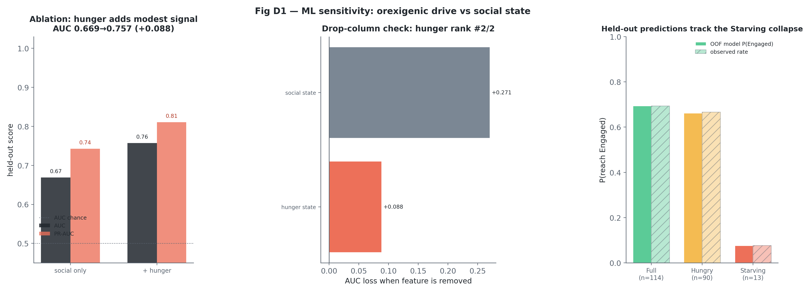

# Orexigenic Drive & Always-On Homeostasis — Analysis Explained

This document explains the data analysis in
[`analysis/orexigenic_analysis.ipynb`](analysis/orexigenic_analysis.ipynb): **what we did, why,
how, and what came out** — and reads the results critically, separating what the code guarantees
from what the data show.

> **System under study.** The *Orexigenic Drive* of the `alwaysOn-embodiedBehaviour` iCub
> controller — a continuous "metabolism" that makes the robot get hungry, ask to be fed, and
> reprioritise its behaviour around recovering energy. Pipeline:
> *perception → salience → executive → remote/Telegram*.

**Contents**

1. [Research questions, design & the defensible spine](#1-research-questions-design--the-defensible-spine)
2. [The data & pipeline](#2-the-data--pipeline)
3. [Statistical approach](#3-statistical-approach)
4. [RQ1 — Does a deficit change behaviour?](#4-rq1--does-a-deficit-change-behaviour)
5. [RQ2 — Does deficit expression close the recovery loop?](#5-rq2--does-deficit-expression-close-the-recovery-loop)
6. [RQ3 — Is the adaptation real? Mechanism (B9) + validation (B10)](#6-rq3--is-the-adaptation-real-mechanism-b9--validation-b10)
7. [Machine-learning sensitivity check](#7-machine-learning-sensitivity-check-phase-d)
8. [Scorecard & bottom line](#8-scorecard--bottom-line)
9. [Reproducing this](#9-reproducing-this)
- [Appendix A — Instrumentation verification (B1/B2)](#appendix-a--instrumentation-verification-b1b2)

---

## 1. Research questions, design & the defensible spine

- **RQ1** — To what extent does the orexigenic drive fulfil the four functions of classical
  homeostasis: (1) internal monitoring, (2) deficit detection, (3) deficit-to-action
  conversion, (4) behavioural prioritisation?
- **RQ2** — Does expressing an orexigenic deficit promote recovery-oriented engagement
  sufficient to support reliable energy replenishment in an always-on social robot?
- **RQ3** — Does the robot's **adaptive component** (the learned per-person homeostatic
  affinity) reflect *real* participant behaviour rather than arbitrary drift, and does what it
  learns change the robot's own later behaviour?

RQ1's first two functions (monitoring, detection) are **true by construction** — the stomach is
a software integrator and the hunger label is derived from its level by the same coded
thresholds under test. They are instrumentation verification, not findings, and live in
[Appendix A](#appendix-a--instrumentation-verification-b1b2). The empirical weight of RQ1 is in
functions (3) and (4): B3 and B4.

### Two design facts that shape everything

**First: the drive was always on.** There is **no drive-off control condition** and none is
invented. RQ2 is identified from within the always-on data: the **graded deficit**
(Full → Hungry → Starving) is the manipulation, and the **proactive vs reactive** contrast
tests whether the drive *initiates* recovery.

**Second: two 4-day phases with a participant role manipulation.** In **Phase 1** (first four
experiment days) two participants were **obligated feeders**, two were told to **interact but
never feed**, and everyone else behaved normally. In **Phase 2** (last four days) all
constraints were lifted. The roles *induce* known behaviour, giving RQ3 ground truth to test
the learning against. These roles are external experimental labels, not controller inputs. The
role map is private (`analysis/private/role_phase.json`); published outputs carry pseudonyms and
role labels only. With **2 people per controlled role**, role contrasts are manipulation
validation with wide uncertainty — never population inference.

### The defensible spine — what carries evidential weight

The analysis reduces to a **three-result spine (B3, B4, B10)** plus one supporting reliability
observation (B7) and an instrumentation appendix. Ranked by how defensible the *identification*
is — not by effect size — this is the order to defend on:

1. **RQ3 role manipulation (B10) — the strongest science, and where the paper leads.** The only
   genuine experimental handle in the study: obligated feeders supplied meals at **2.7× the
   unconstrained rate**, and the no-feed pair fed **zero** (complete separation, exact
   Clopper–Pearson). Near-perfect compliance.
2. **RQ3 dose → affinity (B10).** +0.17 per SD of engagement, and it *strengthens* to **+0.23
   (p ≈ 7×10⁻¹⁴)** when the identity-reconstructed people are excluded — the repair-robustness
   cut turns a data-cleaning liability into a selling point.
3. **RQ3 downstream use (B10).** Prior-day affinity predicts next-day proactive approaches
   (**RR 1.55**, activity-controlled). The cleanest causal-direction claim in the study:
   predictor strictly precedes outcome, so it is leakage-free by construction.
4. **RQ1 behavioural spine (B3 + B4).** Deficit → feeding-pursuit **OR 4.9** and Starving →
   engagement-override **OR 0.03** — both person-clustered GEE, bootstrap-confirmed, both inside
   the BH family. This is the "the drive changes behaviour" result.

**What *not* to stake the defense on:**

- **B7's ~1% Starving occupancy** is a **supporting reliability observation, not the headline** —
  a pooled-regime stationary fraction resting on ~10–17 Starving-row transitions from a
  non-stationary process, and downstream of human behaviour. Never phrase it as "the drive keeps
  itself fed."
- **B1/B2** are true by construction (Appendix A): instrumentation verification.
- **The single always-on condition** means every "the drive *causes* X" is confounded with
  "people are responsive to a robot." The defense is (a) outcome language for RQ2 ("the loop
  closes"), and (b) naming the **drive-off control** as the explicit next study — stated before a
  committee asks (see §8).

### The answers, up front

**RQ1 — the drive is a *threshold* controller.** Monitoring and detection are faithful-
implementation facts (Appendix A). The load-bearing results are behavioural: at the deficit line
the robot switches on a **proactive recovery repertoire** silent at Full — hunger framing
3% → 67%, feed-seeking acts and proactive Telegram pings 1 → 20 and 0 → 172, feeding pursuit
0.15 → 0.43 (**OR 4.9 [2.6, 9.5]**, person-clustered GEE); at the starving line it **overrides**
the social agenda (turns 2.5 → 0.2, Engaged 0.68 → 0.08; **OR 0.03 [0.01, 0.14]**). *Recovery
behaviour is added at 60 and social behaviour overridden at 25 — a two-threshold controller, not
a smooth ramp.*

**RQ2 — the HRI loop closes.** The deficit elicits graded feeding (meal size 21 → 29 → 43) and
modest off-robot replies (proactive ping-reply 0.21–0.26). As a *supporting* reliability
observation, long-run Starving occupancy sits at **~1%** (run-level block bootstrap 95% CI
0.2–3.1%) with no absorbing "starve-out" state — an outcome of the closed loop (drive signals →
humans engage → homeostasis holds), **not a controller self-property**, and one that leans on a
few responsive feeders (Gini 0.57, top-3 = 62%). This is not the study's headline; the
experimental weight is in RQ3.

**RQ3 — the adaptation is real, and the robot acts on it (the strongest result).** The
manipulation validated: obligated feeders supplied meals at **2.7× the unconstrained rate**
[1.2, 5.9], the no-feed pair complied perfectly (**0 feeds in 15 Phase-1 interactions**), and the
feeder excess shrank once roles lifted. The pre-specified core model
(`Δaffinity ~ dose×role + dose×phase + (1|person)`) shows engagement dose predicting affinity
gains (**+0.17 per SD of duration [+0.12, +0.21]**, strengthening to +0.23 without reconstructed
identities), **moderated by role** (feeders' affinity came from *feeding*, not chat length) and
**attenuated in Phase 2**; all three dose definitions agree and the effect survives
leave-one-person-out. And the learning is *used*: **prior affinity raises next-day proactive
approaches 1.55× per +1 affinity [1.09, 2.20]**, activity-adjusted and leakage-free.

---

## 2. The data & pipeline

The robot logs to four SQLite databases (`vision`, `salience_network`, `executive_control`,
`chat_bot`); `data/` holds eight dated snapshots. **Key data-prep discovery:** the folders are
**cumulative snapshots of one growing database**, not eight experiments — naïve stacking would
double-count 4–5×. Everything is therefore de-duplicated to the true units:

- **run** (`run_id`) — one continuous robot session (12 monitored, 10 with visitors);
- **day** (`day_rome`) — 8 days, split 4 + 4 into Phase 1 / Phase 2;
- **interaction** — 217 after de-duplication, over 14 named (pseudonymised) people;
- **affinity update event** — 205 learning-eligible events (the RQ3 unit);
- **person-day, ping, transition, episode** — for the analyses that need them.

### Five gated stages

The analysis is organised as five logical stages with **hard gates** between them — nothing
downstream runs if a gate fails:

1. **Ingest & dedup.** Resolve the cumulative snapshots to canonical `run` / `interaction` /
   `event` units (the double-count fix above). This is the highest-value step; it is first and
   immovable.
2. **Identity & clock harmonisation.** Canonicalise → pseudonymise every identity **once,
   centrally**, and stamp every row with `(run_id, person_id, monotonic_sec, timestamp_epoch,
   day_rome)` before any analysis touches it.
3. **Verification gate (V1–V5 + quality).** One gate against constants extracted from the
   controller source (with file:line references): meal deltas, per-action energy costs, drain
   rate, thresholds, referential integrity, clock sanity. Emits
   [`verification_report.md`](analysis/outputs/verification_report.md); hard checks block the
   run. All passed; nothing proceeds otherwise.
4. **Unit construction.** Freeze the primary analytic tables — `interactions` (unit =
   interaction), `person_day` (unit = person×day), `hs_segments` (unit = state sojourn). Every
   model draws from one of these, so the clustering unit is never ambiguous.
5. **Inference.** B3/B4 on `interactions`; B10 on `person_day` + affinity events; B7 on
   `hs_segments`. Figures and summary last.

### Data harmonisation (four asynchronous streams)

Aligning vision / salience / executive / chat streams sampled at very different rates:

- **Anchor = the interaction**, joined to the other streams by **identity × time-window** —
  nearest event within a pre-window bracketing the interaction start, a **single documented
  rule** (the anchor-lag distribution is reported as a data-quality diagnostic, not silently
  patched with three fallbacks).
- **Identity is the master join key:** `face_id` (vision) ↔ canonical `person_id` ↔ `user_key`
  (chat), resolved through **one** canonicalisation map applied *before* any join. The only
  exposure — the merged-affinity-EMA reconstruction — is robustness-checked in B10.
- **Two clocks, explicit roles:** `monotonic_sec` for within-run durations/dwell (immune to
  wall-clock skew); `timestamp_epoch` for cross-stream alignment and day keys. Never mixed in a
  single calculation.
- **Ordinal categoricals** (HS1 < HS2 < HS3; SS1 < SS4) kept as ordered factors; continuous dose
  predictors z-scored — no one-hot encoding that discards the ordering.
- **Missingness handled at the harmonisation layer, not the model:** duration is missing ~53% of
  the time *differentially by phase*, so the fully-observed `n_turns` and `active_energy_cost` are
  the **primary** dose and `duration_sec` is a **confirmatory secondary** — the complete-case
  duration slope is never the load-bearing number.

---

## 3. Statistical approach

The model choice is driven by two facts: **what kind of outcome is being analysed** and
**whether observations are independent**. Most outcomes here are binary events, event counts,
continuous learning updates, or time spent in hunger states; and many observations repeat
within the same people, runs and days. For that reason, **no confirmatory claim rests on
row-independence tests** such as plain t-tests, ANOVA, chi-square tests, or unclustered
correlations. Those tests would treat repeated observations from the same person/run as if
they came from new independent participants.

### Why each model was used

| Purpose in this study | Outcome type | Model used | Why this model was chosen |
|---|---|---|---|
| Deficit-to-action conversion: does Hungry/Starving increase feeding pursuit? | Binary event per interaction: pursued feeding, yes/no | **Logistic GEE, clustered on person** | The outcome is binary, so logistic regression gives odds ratios. GEE keeps the interpretation population-level while using robust sandwich SEs for repeated observations within people. |
| Starving override: does Starving suppress completed social engagement? | Binary event per interaction: Engaged vs not engaged | **Logistic GEE, clustered on person**, adjusted for social state | Same binary-outcome logic, with clustering because the same people contribute multiple interactions. Adjustment separates hunger-state override from the current social-state context. |
| Role manipulation: did obligated feeders supply more meals per person-day? | Count outcome: number of meals | **Poisson GEE, clustered on person** | Meal supply is a count/rate, so Poisson regression estimates rate ratios. GEE protects the inference from repeated person-days belonging to the same participant. |
| Downstream use of learning: does prior affinity increase next-day proactive approaches? | Count outcome: number of proactive approaches | **Poisson GEE, clustered on person** | The question is about a count of robot actions on the next day. A rate-ratio model is the natural scale, and clustering handles repeated days per person. |
| Core affinity validation: does engagement dose predict `Δaffinity`, moderated by role/phase? | Continuous outcome: change in affinity after an update | **Linear mixed model with a person random intercept** | `Δaffinity` is continuous. The random intercept lets each person have their own baseline while estimating the common dose, role and phase effects. Cluster-robust OLS is reported as a companion check. |
| No-feed role compliance | 0 feeds in the no-feed group during Phase 1 | **Exact Clopper-Pearson confidence interval** | Complete separation makes a logistic/Poisson GLM unstable or unidentifiable. Exact binomial intervals report the compliance result directly. |
| Long-run reliability (supporting): what fraction of time is the robot Starving? | Time occupancy across Full/Hungry/Starving states | **Continuous-time Markov chain (CTMC)** with **run-level block bootstrap** | Reliability is about transitions and dwell times, not a per-row mean. CTMC estimates the steady-state occupancy implied by observed state changes; run-level bootstrap gives an interval that respects run-level clustering. Reported as a supporting observation (pooled, non-stationary process — see B7). |
| Machine-learning sensitivity check | Held-out prediction of engagement | **Regularised logistic models with group-aware CV** | This is not confirmatory inference. It checks whether hunger adds out-of-sample signal beyond social state while leaving out whole runs or people to avoid leakage. |

### Why not the simpler textbook tests?

- **t-tests/ANOVA** are for independent continuous outcomes. Most headline outcomes here are
  binary, counts, time occupancy, or repeated continuous updates; using t-tests/ANOVA would
  answer the wrong outcome-scale question and ignore clustering.
- **Mann-Whitney/Kruskal-Wallis/Spearman** are useful descriptive non-parametric companions,
  but they do not naturally handle the repeated person/run structure or the role/phase
  moderation needed for RQ3.
- **Plain linear regression** is appropriate for independent continuous outcomes; the affinity
  analysis instead uses a mixed model because multiple updates come from the same person.
- **Cox proportional hazards regression** would be the standard survival model for larger
  time-to-event data, but the Starving episode set has only 8 episodes, so a Cox model would be
  overfit — time-to-first-feed is reported as a single descriptive statistic only (§5), and the
  CTMC carries the reliability observation.
- **Negative binomial regression** was not the primary count model because the confirmatory
  count analyses are small, clustered rate-ratio questions handled with robust Poisson GEE and
  bootstrap checks. If strong overdispersion dominated a larger count analysis, negative
  binomial would be the natural alternative.

Other safeguards:

- **Multiplicity** → Benjamini-Hochberg **within two pre-declared families** (RQ1/2 behaviour;
  RQ3 adaptation). **Every p-value used as evidence sits inside a declared family** — including the
  small-n B4 Starving override, which is folded into the RQ1/2 family for honest book-keeping even
  though its verdict is led by effect size + CI + bootstrap, not NHST (5/5 metrics survive q<0.05).
  Implementation checks (B1/B2) get no inferential p-values at all.
- **Power** → simulation-based **minimum detectable effects** under the observed clustering
  (never post-hoc power): this design reliably detects ORs ≳ 3 and Δaffinity slopes ≳ 0.075
  per SD; role contrasts (2 people/role) detect only very large effects.
- **Small-n Starving results** → Starving is small-n (13 interactions, 8 episodes), so the
  report leads with effect sizes + CIs, uses "directional" labels, and avoids covariate models
  on single-digit episode counts.

---

## 4. RQ1 — Does a deficit change behaviour?

*(Monitoring & detection — RQ1 functions 1–2 — are true by construction and live in
[Appendix A](#appendix-a--instrumentation-verification-b1b2). The two results below carry RQ1.)*

**B3 — deficit → action conversion.** The right contrast is **Full vs deficit (Hungry +
Starving)**. A deficit switches on a recovery repertoire that is silent at Full:

| Behaviour (Full → Deficit) | Full | Deficit | Note |
|---|---|---|---|
| Hunger framing in speech | 2.8% | 66.5% | prompt-driven (coded gate) |
| Feed-seeking speech acts | 1 | 20 | deficit-only (coded gate) |
| Proactive Telegram pings | 0 | 172 | deficit-only (coded gate) |
| Co-present feeding pursuit | 0.15 | 0.43 | **emergent human response** |
| Mean meal size | 21.2 | 31.4 | emergent |

The coded gates verify the state switches the action repertoire; the emergent rows measure how
strongly behaviour actually changes. **Inferential anchor** (person-clustered logistic GEE on
feeding pursuit): **OR 4.9 [2.6, 9.5]**, p ≈ 2×10⁻⁶; leave-one-person-out OR range 4.1–6.1.
*Verdict: Supported.*


*Fig 4 — units: 367 interaction turns, 710 chat messages, 217 co-present interactions, and
193 deficit-gated action events. Recovery-action rates Full vs deficit (left, bootstrap CIs)
and the deficit-gated actions plotted on the actual stomach-level timeline (right).*

**B4 — the Starving override (centrepiece).** When Starving, conversation **collapses** (turns
2.5 → 0.2; Engaged 0.68 → 0.08; person-clustered GEE adjusted for social state: **OR 0.034
[0.008, 0.136]**) while feeding pursuit **rises** (0.26 → 0.54) — reprioritisation, not
disengagement, exactly as the coded `_run_hunger_tree` override specifies. Starving n = 13:
a large, directionally robust effect, not a precise estimate. *Verdict: Supported.*


*Fig 5 — unit: interaction, n = 217; Starving column n = 13. Completion peaks at
Greeted×Hungry (0.93) and stays high for known people until the Starving column zeroes it out
— hunger doesn't erode conversation, one override ends it.*

---

## 5. RQ2 — Does deficit expression close the recovery loop?

**B5 — deficit expression elicits recovery.** Meal size grows with the deficit at feed time
(Full 21 / Hungry 29 / Starving 43); proactive Telegram pings drew replies within 1 h at
**0.21 [0.15, 0.26]** (hs3-specific: 0.26) — modest but real, and drive-*initiated*:
co-present interactions are 83% reply-bearing when proactive vs 42% reactive.
*Verdict: Supported.*


*Fig 8 — unit: proactive Telegram ping, n = 234 across 12 subscribers; response window = 1 h.
Proactive pings by type and their response-to-ping rates with bootstrap CIs.*

**B6 — observed Starving episodes (exploratory, n = 8, one sentence).** All 8 Starving episodes
received a feed, escaped Starving, and recovered to Full via feeding (median time-to-first-feed
21 s) — an operational status check, not a population recovery rate; reliability is carried by
B7, not by these episodes.

**B7 — long-run reliability (a *supporting* observation, not the headline).** A continuous-time
Markov chain over Full/Hungry/Starving, fitted from observed transitions and dwell times, gives
long-run **Starving occupancy: median 1.0% [95% CI 0.2%, 3.1%]** by run-level block bootstrap
(the cluster-honest interval; the transition-level Poisson bootstrap's 1.1% [0.4, 2.3] agrees),
with **no absorbing state**. **Reading:** the transition rates are a record of how the humans
behaved — every Starving spell ended because someone fed the robot — so this is the *outcome of
the closed HRI loop*, not a self-property of the controller. **Three reasons it stays
supporting, not headline:** (i) it rests on only ~10–17 Starving-row transitions; (ii) the CTMC
is time-homogeneous but the deployment is not — one generator pools visited daytime runs, idle
no-visitor runs and both phases, so the figure is the stationary fraction of a *pooled* process,
not of any real operating regime (the pooling is conservative: idle drain-only runs push Starving
*up*, so read the interval as an order-of-magnitude ceiling, not a calibrated rate); and (iii)
replenishment leans on a few responsive feeders (Gini 0.57, top-3 = 62% of meals). Single-
condition caveat: the drive's exact causal share of the feeding cannot be isolated.
*Verdict: Supported, as an outcome of the loop.*


*Fig 9 — unit: CTMC state sojourn/transition reconstructed from 165,460 hunger events across
12 monitored runs. Modelled occupancy lands on the empirical time-occupancy (Starving 1.1%
vs 1.8%); mean Starving sojourn 163 s.*

---

## 6. RQ3 — Is the adaptation real? Mechanism (B9) + validation (B10)

**This is the study's strongest result and the spine of the paper.**

**B9 — the mechanism, verified.** The salience network learns a per-person **affinity** — an
EMA (α = 0.25) of normalised homeostatic reward in [−1, +1]. Verified against the code and
logs: the EMA **converges** (mean |update| 0.10 → 0.06); the IPS perceptual weights **never
change** — learning acts only through the per-person eligibility threshold
`eff_thr = max(0.50, base_ss − 0.15·affinity)` (reproduces every logged value to 1e-4,
giving high-affinity people up to ~0.14 lower a bar); and the chatbot gates Hungry-state pings
to the 11/14 people above affinity 0.20. *(Data repair: the EMA was re-threaded over merged
identity variants, validated to 1e-4 for all non-merged people. Because this re-threading is the one
cleaning step that touches an RQ3 outcome variable, B10 re-fits its core dose→affinity model with all
canonicalization-merged people excluded — `outputs/rq3_affinity_repair_robustness.csv` — and the
duration slope not only survives but strengthens (+0.17 → +0.23, p≈7e-14), so the effect is carried by
non-reconstructed people, not manufactured by the repair.)* B9 shows the machinery works
as coded; **whether what it learned reflects reality is B10's question.**

**B10 — the validation (all three confirmatory metrics survive BH, q < 0.05).**

1. **Manipulation check.** Feeders supplied meals at **2.7× the unconstrained rate** in
   Phase 1 (person-clustered Poisson GEE [1.2, 5.9], p = .013); the no-feed pair recorded
   **0 feeds in 15 Phase-1 interactions** (exact CI [0, 0.22] — perfect compliance, handled
   with exact intervals since separation makes a GLM unidentifiable); the feeder excess shrank
   ×0.43 [0.15, 1.22] once roles lifted.
2. **Core model** — the pre-specified form `y = role·x + phase·x + b`, one row per learning
   event, linear mixed model with person random intercept, fitted pooled and within each
   phase. For unconstrained people, +1 SD of interaction duration predicts **Δaffinity +0.17
   [+0.12, +0.21]** (p ≈ 2×10⁻¹³); the coupling is **moderated by role** (feeder × duration
   −0.15 [−0.26, −0.04], p = .006 — feeders' affinity came from *feeding*, and long
   non-feeding chats cost the robot energy) and **attenuates in Phase 2** (−0.08
   [−0.14, −0.02], p = .012). Duration is missing for ~53% of events *differentially by
   phase* (salience-link dependent), so the fully-observed doses `n_turns` and
   `active_energy_cost` serve as the pre-specified **primary** agreement checks — all three
   agree in sign, all p < 10⁻⁶ (`outputs/rq3_missingness.csv`, `outputs/rq3_model_results.csv`).
   Leave-one-person-out slope range +0.13 to +0.22; **excluding the identity-reconstructed
   people strengthens the slope to +0.23** (`outputs/rq3_affinity_repair_robustness.csv`).
3. **Downstream use, leakage-free.** Affinity *as of yesterday* predicts today's proactive
   approaches: **rate ratio 1.55 per +1 affinity [1.09, 2.20]** (p = .016, Poisson GEE,
   controlling yesterday's interaction count and phase).

**Verdict: Supported.** The adaptive component is a faithful record of who actually fed and
engaged with the robot — including behaviour we experimentally induced — and it feeds back
into the robot's own approach behaviour. It is not arbitrary. (Limit: with 2 people per
controlled role, role contrasts are validation, not population inference.)


*Fig 10 — unit: learning update event, n = 239 raw updates / 205 learning-eligible RQ3 events
over 14 named people plus unknown. Affinity trajectories coloured by Phase-1 experimental role
label (green = feeder, red dashed = no-feed, blue = unconstrained; dashed vertical = phase
boundary).*


*Fig 12 — units: interaction and person-day; 217 interactions, 14 named people, 8 days;
controlled roles = 2 feeders + 2 no-feed in Phase 1. The manipulation validated: feed
probability per interaction with exact 95% CIs (left; the no-feed 0/15 and its Phase-2 release
are directly visible) and meals per person-day with the GEE rate ratios (right). Roles are
external experiment metadata, not robot software inputs.*


*Fig 13 — unit: learning update event; duration-linked subset n ≈ 97, fully observed dose
checks use all learning-eligible events n = 205. The core RQ3 model: raw duration-linked
learning events with per-role trends (left) and the mixed-model coefficients with 95% CIs
(right) — dose slope, role/phase moderations, and the dose-agreement slopes.*

---

## 7. Machine-learning sensitivity check *(Phase D)*

A single specificity footnote, not a modelling contribution: ~200 rows, group-aware CV
(leave-one-run/person-out), descriptive only. **D1 — does hunger add held-out signal beyond
social state?** Adding hunger state improves Engaged prediction AUC 0.669 → 0.757 (+0.088) and
PR-AUC +0.068 (leave-one-run-out GBM; the leave-one-person-out variant is weaker at 0.735, and
both are reported in `ml_model_metrics.csv`); drop-column CV ranks hunger #2/2 behind social
state. The out-of-fold predictions reproduce the Starving collapse — **corroborating B4, not
proving it**. Social state dominates, which is why hunger is treated as sensitivity evidence
rather than a confirmatory mechanism test.



*Fig D1 — unit: interaction, n = 217; grouped CV leaves out runs/persons. Hunger adds held-out
signal; social state dominates; out-of-fold predictions track the Starving collapse.*

---

## 8. Scorecard & bottom line

| # | Claim | Source | Outcome |
|---|---|---|---|
| RQ3 | Adaptive affinity reflects real behaviour & is used | B10 | **Supported** *(the spine)* |
| RQ1-3 | Deficit→action is real, not cosmetic | B3 | **Supported** |
| RQ1-4 | Starving overrides the social agenda | B4 | **Supported** |
| RQ2-a | Deficit expression elicits recovery | B5 | **Supported** |
| RQ2-c | Replenishment reliable long-run (loop outcome) | B7 | **Supported** *(supporting obs.)* |
| RQ2-b | Observed Starving episodes resolve by feeding | B6 | **Supported (exploratory)** |
| RQ1-1 | Internal monitoring continuous & autonomous | B1 | **Supported** *(faithful impl. — App. A)* |
| RQ1-2 | Deficit detection correct (60/25) | B2 | **Supported** *(faithful impl. — App. A)* |

**Bottom line.** The load-bearing result is **RQ3**: the learned affinities recover the
experimentally induced roles, follow engagement dose in the pattern the design implies
(strengthening once identity-reconstructed people are removed), and demonstrably redirect the
robot's proactive effort toward the people who sustain it — the study's one genuinely
experimental handle. **RQ1** supplies the behavioural mechanism: a faithfully implemented
**threshold homeostatic controller** — silent recovery repertoire off at Full, on at Hungry,
social agenda hard-overridden at Starving. **RQ2** shows the loop **closes in deployment**:
human engagement, with demonstrated participation from the drive, kept the robot out of
starvation ~99% of the time — an outcome of people feeding a signalling robot, not a controller
self-property.

**Scope & the next study.** Everything above is a within-deployment characterization of *one*
robot at *one* site over 8 session-days (12 runs, 14 named people, convenience sample) — existence-
and-magnitude evidence for this HRI loop, not population estimates that transfer across robots,
sites, or cohorts. The governing limitation is structural: with a single always-on condition, the
drive's causal share in the feeding (hence in B7's low Starving occupancy) cannot be separated from
people simply being responsive to a robot. The decisive next study is a **drive-off / drive-ablated
control arm** — same robot, same protocol, orexigenic signalling suppressed — which converts RQ2
from "the loop closes" (an outcome) into an identified causal estimate of the drive's contribution.
Secondary next steps: more people per controlled role (RQ3 rests on 2/role) and a multi-site
replication for generalization.

---

## 9. Reproducing this

The notebook is generated from [`analysis/build_notebook.py`](analysis/build_notebook.py):

```bash
make execute   # regenerate and execute analysis/orexigenic_analysis.ipynb
make check     # validate execution state and identity redaction
```

- Seed `SEED=42`; DB access strictly read-only; deterministic re-runs from
  `analysis/cache/*.parquet`.
- **Privacy:** identities pseudonymised to `P01…P14`; real-name and role maps live only in the
  git-ignored `analysis/private/`; `make check` scans every published surface for leaks.
- Pinned dependencies: `analysis/requirements.txt`.

**Key outputs:** [`results_summary.md`](analysis/outputs/results_summary.md),
[`verification_report.md`](analysis/outputs/verification_report.md),
[`rq3_model_results.csv`](analysis/outputs/rq3_model_results.csv),
[`rq3_missingness.csv`](analysis/outputs/rq3_missingness.csv),
[`rq3_affinity_repair_robustness.csv`](analysis/outputs/rq3_affinity_repair_robustness.csv),
[`bh_corrected_pvalues.csv`](analysis/outputs/bh_corrected_pvalues.csv),
[`success_criteria.csv`](analysis/outputs/success_criteria.csv).

---

## Appendix A — Instrumentation verification (B1/B2)

These two checks are **true by construction** and are therefore not results: they verify that
the logged data behaves as the controller source specifies. They are kept out of the results
narrative on purpose — a reviewer who sees them framed as findings sees the tautology
immediately.

**B1/B2 — monitoring & detection.** The stomach level is a software integrator and the hunger
label is derived from it by the coded 60/25 thresholds, so "drain = 1.00× nominal" (zero-width
CI — the tell) and "transitions bracket the thresholds (1.00/1.00 accuracy)" hold **by
construction**. The genuinely non-trivial content is operational rather than inferential: the
drive samples every ~2.3 s across 12 runs / 46 h, keeps draining in two runs with zero visitors
(autonomy), and shows **zero rapid reversals** at either threshold (no label flapping).
*Reading: the instrumentation behaves exactly as coded; no empirical claim is made here.*


*Fig 2 — unit: hunger-level event, n = 165,460 across 12 monitored runs / 8 days. The
homeostatic loop made visible: autonomous sawtooth drain, discrete feeding recoveries
(arrows ∝ meal size), Starving as thin red slivers.*
